```mermaid
flowchart LR
    A["ERP SKU 维护外箱尺寸与毛重"] --> B["入库单打印并贴箱"]
    B --> C["海外仓扫码收货并上传照片"]
    C --> D["按 SKU 推荐并人工确认逻辑库位"]
    D --> E["库位库存可用"]
    E --> F["ERP 平台订单确认或人工订单提交"]
    F --> G["创建一订单一包裹履约并预占库位库存"]
    G --> H["海外仓单个或批量下架"]
    H --> I["生成拣货任务并打印拣货单"]
    I --> J["按订单顺序扫描订单、库位、内部 SKU"]
    J --> K["获取并打印平台面单，扫码核验"]
    K --> L["打包"]
    L --> M["签出"]
    M --> N["平台最终动作 + 库存实扣 + 出库计费"]
```

# 逻辑库位库存与订单履约统一实施计划

> **执行人员须知：** 必须使用 `superpowers:subagent-driven-development`（推荐）或 `superpowers:executing-plans`，按照任务逐项实施本计划。所有步骤使用复选框（`- [ ]`）跟踪进度。

**目标：** 将现有“几何库位 + 托盘/托位 + 批次库存 + 销售出库单”改造成“动态逻辑库位 + 无批次库位库存 + 一订单一包裹履约”，并打通 ERP 确认、海外仓下架、顺序拣货、平台面单、打包签出、库存实扣与收费。

**总体架构：** 先建立独立的 `wms_location_inventory` 库位库存内核和动态逻辑库位 API，所有入库、移库、盘点、退货质检、报废统一改用该内核；再建立 `wms_fulfillment_order` 订单级履约聚合，ERP 提交时预占库位库存，海外仓按订单下架并按任务顺序拣货，签出时才实扣库存和记费。旧托盘、托位、批次、销售出库单、固定格口链路在新链路验收前只读保留，验收后再停用菜单和写入口，不在首轮迁移中直接删表。

**技术栈：** Java 8、Spring Boot 2.7.18、MyBatis-Plus、MySQL 8、JUnit 5、Mockito、Vue 3.5、TypeScript 5.7、Ant Design Vue 4、pnpm 8、Vite 5、Node 测试运行器。

## 全局约束

- 库存唯一业务维度固定为：平台租户、WMS 服务商、货主、仓库、逻辑库位、ERP SKU、品质；不包含批次、托盘和托位。
- 每箱必须粘贴内部 SKU 标签；ERP SKU 必须维护外箱长、宽、高和单箱毛重，缺失时禁止创建入库单和履约订单。
- 所有库位在库存层都是逻辑位置；`TEMP` 公共暂存区允许所有 WMS 服务商使用并允许直接拣货出库。
- 库位可混货主、混 SKU；库存行必须保留 WMS 服务商和货主归属，不得跨归属合并。
- 三维装箱只提供推荐数量；人工可覆盖推荐和体积利用率，最大承重和最大 SKU 种类数是硬限制。
- 已预占数量禁止人工移库；可移动数量固定为 `quantity - reserved_quantity`。
- 平台订单和人工出库都遵守“一订单 = 一个物理包裹”；禁止拆包和合包。
- ERP 提交履约时预占库存；拣货只记录实拣；签出时才扣减 `quantity` 和 `reserved_quantity`，并产生一次出库收费。
- Ozon、Wildberries、Yandex 的平台动作必须由独立适配器按阶段执行，不能使用一个通用“确认发货”动作替代。
- 批量下架、批量签出按订单返回成功和失败结果，不允许一单失败回滚整批。
- 旧业务表首轮上线只读保留；新链路验收完成后隐藏旧菜单、关闭旧写接口，删表另行做独立迁移。
- 本次不做 FBO 库存内核改造，不改变平台财务数据口径，不引入新的托盘、货垛或固定分货格实体。
- 当前仓库存在大量未提交修改；每个任务只暂存本任务明确列出的文件，不得使用 `git add .`。

---

## 最终决策与冲突修正

这份计划合并并取代以下两份方案中的实施顺序和冲突条款，原文件继续作为需求讨论记录：

- `docs/superpowers/specs/2026-08-15-logical-location-inventory-redesign.md`
- `docs/superpowers/specs/2026-08-16-order-level-warehouse-fulfillment-design.md`

合并时修正如下：

1. “整托出库”只保留为可选计费分类，不再由托盘实体判断，也不得阻塞普通平台订单。
2. 库存实扣统一放在签出事务，不在拣货完成时扣减。
3. 人工出库不建立第二套主表，使用 `wms_fulfillment_order.source_type = MANUAL` 和 `DRAFT` 状态。
4. 固定分货格和二次分货退出新流程；批量任务内部按订单顺序逐单拣货、贴面单、打包。
5. 平台仓库标识与内部 `wms_warehouse.id` 分列保存，店铺默认仓只能引用内部仓库。
6. 旧表不在首轮发布删除；先停止读写并保留审计查询。
7. 因确认采用“清理仓库业务数据后重新建账”，不建设旧库存双写或批次迁移桥。

平台阶段固定如下，前端按钮统一，后端行为不可混用：

| 阶段 | Ozon | Wildberries | Yandex | 人工订单 |
|---|---|---|---|---|
| 下架接单 | 一包裹组包/发货准备 | 创建或选择供货、加入订单、确认组装 | 只做仓库内部接单 | 只做仓库内部接单 |
| 拣齐后 | 轮询获取面单 | 获取 WB 面单 | 设置单箱商品布局 | 生成系统面单 |
| 贴单打包 | 扫描面单复核码 | 扫描面单复核码 | 获取面单并扫描复核码，随后设置 `READY_TO_SHIP` | 扫描系统面单复核码 |
| 签出 | 按配送方式执行最终动作/交接单 | 正式交运；供货满足条件后关闭 | 执行当前履约模式最终动作 | 只完成本地签出 |

所有阶段动作都写 `wms_fulfillment_platform_action`，使用 `(fulfillment_order_id, action_type)` 唯一键保证幂等；网络超时必须先查询平台实际状态再决定是否重试。

## 目标文件结构

### 新后端模块边界

- `wms/model/entity/WmsLocationInventory.java`: 无批次库位库存实体。
- `wms/service/LocationInventoryService.java`: 加锁、增减、预占、释放、签出实扣的唯一库存写入口。
- `wms/service/LocationCapacityService.java`: 体积、重量、SKU 种类硬校验与利用率计算。
- `wms/service/LocationRecommendationService.java`: 三维装箱推荐，不承担最终业务校验。
- `wms/model/entity/WmsFulfillmentOrder.java`: 一订单一包裹履约主表。
- `wms/model/entity/WmsFulfillmentItem.java`: 履约商品快照。
- `wms/model/entity/WmsInventoryReservation.java`: 订单到库位库存的预占明细。
- `wms/service/FulfillmentOrderService.java`: 创建、取消、状态 CAS 和查询。
- `wms/service/FulfillmentReservationService.java`: 预占、释放、签出扣减。
- `wms/service/platform/FulfillmentPlatformAdapter.java`: 平台分阶段动作接口。
- `wms/service/FulfillmentPickingService.java`: 任务、顺序拣货、扫描和打包。
- `wms/service/FulfillmentShippingService.java`: 签出、平台最终动作、库存实扣和计费编排。

### 新前端模块边界

- `src/api/wms/location-inventory/`: 库位库存双视图和详情 API。
- `src/views/platform/location-inventory/`: 网格、树形列表和库位详情。
- `src/api/wms/fulfillment/`: ERP 与海外仓共用履约 API 类型。
- `src/views/wms/manual-fulfillment/`: 人工出库订单。
- `src/views/platform/fulfillment-shelf/`: 订单下架。
- `src/views/platform/fulfillment-workbench/`: 顺序拣货、面单、打包与签出。

## 阶段验收门槛

- 阶段 A：任务 1-7 完成后，新库位与库存内核可独立运行，但旧业务仍可读。
- 阶段 B：任务 8-11 完成后，入库、移库、盘点、退货质检、报废全部使用新库存。
- 阶段 C：任务 12-18 完成后，订单级履约端到端可运行。
- 阶段 D：任务 20 完成备份、清理、建账和菜单切换后，才允许正式验证新流程。

## 端到端业务流程



---

### 任务 1：固化基线并增加切换开关

**涉及文件：**
- 新建： `erp-backend/admin/src/main/java/com/erp/admin/wms/config/WmsCoreModeProperties.java`
- 修改： `erp-backend/admin/src/main/resources/application.yml`
- 新建： `erp-backend/admin/src/test/java/com/erp/admin/wms/WmsCoreModePropertiesTest.java`
- 新建： `docs/operations/wms-logical-location-cutover.md`

**接口关系：**
- 产出：`WmsCoreModeProperties.Mode { LEGACY, LOGICAL_LOCATION }` 和配置项 `erp.wms.core-mode`。
- 依赖：管理端模块现有的 Spring Boot 配置绑定机制。

- [ ] **步骤 1：记录改造前基线**

执行：

```powershell
git status --short
mvn -f erp-backend/pom.xml -pl admin -DskipTests package
pnpm --dir erp-frontend type-check
```

预期：将准确的通过/失败输出保存到 `docs/operations/wms-logical-location-cutover.md`；只记录与本次改造无关的既有失败，本任务不处理这些失败。

- [ ] **步骤 2：编写预期失败的配置测试**

```java
assertThat(properties.getMode()).isEqualTo(WmsCoreModeProperties.Mode.LEGACY);
```

- [ ] **步骤 3：运行定向测试**

执行：`mvn -f erp-backend/pom.xml -pl admin -Dtest=WmsCoreModePropertiesTest test`

预期：测试失败，因为 `WmsCoreModeProperties` 尚不存在。

- [ ] **步骤 4：实现切换开关**

```java
@ConfigurationProperties(prefix = "erp.wms")
public class WmsCoreModeProperties {
    public enum Mode { LEGACY, LOGICAL_LOCATION }
    private Mode coreMode = Mode.LEGACY;
}
```

在 `application.yml` 中增加 `erp.wms.core-mode: LEGACY`。只有执行任务 20 时才切换生产模式。

- [ ] **步骤 5：验证并只提交本任务文件**

```powershell
mvn -f erp-backend/pom.xml -pl admin -Dtest=WmsCoreModePropertiesTest test
git add erp-backend/admin/src/main/java/com/erp/admin/wms/config/WmsCoreModeProperties.java erp-backend/admin/src/main/resources/application.yml erp-backend/admin/src/test/java/com/erp/admin/wms/WmsCoreModePropertiesTest.java docs/operations/wms-logical-location-cutover.md
git commit -m "chore: add wms core cutover guard"
```

### 任务 2：创建逻辑库位与库存表结构

**涉及文件：**
- 新建： `erp-backend/sql/migration/V103__logical_location_inventory_core.sql`
- 修改： `erp-backend/admin/src/main/java/com/erp/admin/wms/model/entity/WmsLocation.java`
- 新建： `erp-backend/admin/src/main/java/com/erp/admin/wms/model/entity/WmsLocationInventory.java`
- 新建： `erp-backend/admin/src/main/java/com/erp/admin/wms/mapper/WmsLocationInventoryMapper.java`
- 新建： `erp-backend/admin/src/main/resources/mapper/wms/WmsLocationInventoryMapper.xml`
- 新建： `erp-backend/admin/src/test/java/com/erp/admin/wms/LocationInventorySchemaTest.java`

**接口关系：**
- 产出：按服务商、货主、仓库、库位、SKU 和品质构成唯一业务维度的 `WmsLocationInventory`。
- 产出：Mapper 方法 `selectForUpdate(Long id)` 和 `selectAvailableForUpdate(Long warehouseId, Long erpTenantId, String skuCode, String quality)`。

- [ ] **步骤 1：编写预期失败的表结构契约测试**

断言迁移脚本包含唯一键和数量校验：

```java
assertThat(sql).contains("uk_location_inventory_owner_sku_quality");
assertThat(sql).contains("reserved_quantity");
assertThat(sql).contains("version");
```

- [ ] **步骤 2：运行测试并确认失败**

执行：`mvn -f erp-backend/pom.xml -pl admin -Dtest=LocationInventorySchemaTest test`

预期：测试失败，因为 `V103__logical_location_inventory_core.sql` 尚不存在。

- [ ] **步骤 3：增加迁移脚本和实体**

迁移脚本必须包含：

```sql
CREATE TABLE wms_location_inventory (
  id BIGINT PRIMARY KEY AUTO_INCREMENT,
  tenant_id BIGINT NOT NULL,
  wms_tenant_id BIGINT NOT NULL,
  erp_tenant_id BIGINT NOT NULL,
  warehouse_id BIGINT NOT NULL,
  location_id BIGINT NOT NULL,
  sku_code VARCHAR(128) NOT NULL,
  quality VARCHAR(32) NOT NULL,
  quantity INT NOT NULL DEFAULT 0,
  reserved_quantity INT NOT NULL DEFAULT 0,
  version INT NOT NULL DEFAULT 0,
  deleted TINYINT NOT NULL DEFAULT 0,
  UNIQUE KEY uk_location_inventory_owner_sku_quality
    (tenant_id,wms_tenant_id,erp_tenant_id,warehouse_id,location_id,sku_code,quality,deleted)
);
```

为 `wms_location` 增加排编号、顺序号、类型、尺寸、最大承重、最大 SKU 种类数和 `public_shared`；新的 API 模型不得再增加层位或托位字段。

- [ ] **步骤 4：实现 Mapper 加锁查询并运行测试**

执行：`mvn -f erp-backend/pom.xml -pl admin -Dtest=LocationInventorySchemaTest test`

预期：测试通过。

- [ ] **步骤 5：提交本任务修改**

```powershell
git add erp-backend/sql/migration/V103__logical_location_inventory_core.sql erp-backend/admin/src/main/java/com/erp/admin/wms/model/entity/WmsLocation.java erp-backend/admin/src/main/java/com/erp/admin/wms/model/entity/WmsLocationInventory.java erp-backend/admin/src/main/java/com/erp/admin/wms/mapper/WmsLocationInventoryMapper.java erp-backend/admin/src/main/resources/mapper/wms/WmsLocationInventoryMapper.xml erp-backend/admin/src/test/java/com/erp/admin/wms/LocationInventorySchemaTest.java
git commit -m "feat: add logical location inventory schema"
```

### 任务 3：实现动态库位管理

**涉及文件：**
- 修改： `erp-backend/admin/src/main/java/com/erp/admin/wms/controller/WmsLocationManageController.java`
- 修改： `erp-backend/admin/src/main/java/com/erp/admin/wms/service/WmsLocationService.java`
- 修改： `erp-backend/admin/src/main/java/com/erp/admin/wms/mapper/WmsLocationMapper.java`
- 新建： `erp-backend/admin/src/main/java/com/erp/admin/wms/model/dto/LogicalLocationCreateDTO.java`
- 新建： `erp-backend/admin/src/main/java/com/erp/admin/wms/model/dto/LogicalLocationUpdateDTO.java`
- 新建： `erp-backend/admin/src/test/java/com/erp/admin/wms/WmsLogicalLocationServiceTest.java`

**接口关系：**
- 产出：`createLocation(LogicalLocationCreateDTO)`、`updateLocation(Long, LogicalLocationUpdateDTO)`、`deleteEmptyLocation(Long)`。
- 依赖：使用 `WmsLocationInventoryMapper` 确认库位为空后才能删除。

- [ ] **步骤 1：编写预期失败的服务测试**

覆盖：新增库位时不重排旧编号、拒绝重复编号、存在库存或预占时禁止删除、允许删除空库位、公共 `TEMP` 库位无需货架分配。

```java
assertThatThrownBy(() -> service.deleteEmptyLocation(10L))
    .hasMessageContaining("库位仍有库存或预占");
```

- [ ] **步骤 2：运行定向测试**

执行：`mvn -f erp-backend/pom.xml -pl admin -Dtest=WmsLogicalLocationServiceTest test`

预期：因缺少对应方法而测试失败。

- [ ] **步骤 3：实现事务命令**

```java
@Transactional
public Long createLocation(LogicalLocationCreateDTO dto)

@Transactional
public void deleteEmptyLocation(Long locationId)
```

库位编号创建后不可修改；顺序号使用数值类型；已删除的编号不自动重复使用。

- [ ] **步骤 4：验证 API 和测试**

提供 `POST /wms/location`、`PUT /wms/location/{id}`、`DELETE /wms/location/{id}` 和按排分组查询接口。随后运行定向测试和 `mvn ... -DskipTests package`。

- [ ] **步骤 5：提交列出的文件**

```powershell
git add erp-backend/admin/src/main/java/com/erp/admin/wms/controller/WmsLocationManageController.java erp-backend/admin/src/main/java/com/erp/admin/wms/service/WmsLocationService.java erp-backend/admin/src/main/java/com/erp/admin/wms/mapper/WmsLocationMapper.java erp-backend/admin/src/main/java/com/erp/admin/wms/model/dto/LogicalLocationCreateDTO.java erp-backend/admin/src/main/java/com/erp/admin/wms/model/dto/LogicalLocationUpdateDTO.java erp-backend/admin/src/test/java/com/erp/admin/wms/WmsLogicalLocationServiceTest.java
git commit -m "feat: support dynamic logical locations"
```

### 任务 4：实现容量校验与三维装箱推荐

**涉及文件：**
- 新建： `erp-backend/admin/src/main/java/com/erp/admin/wms/service/LocationCapacityService.java`
- 新建： `erp-backend/admin/src/main/java/com/erp/admin/wms/service/LocationRecommendationService.java`
- 新建： `erp-backend/admin/src/main/java/com/erp/admin/wms/model/vo/LocationCapacityVO.java`
- 新建： `erp-backend/admin/src/main/java/com/erp/admin/wms/model/vo/LocationRecommendationVO.java`
- 新建： `erp-backend/admin/src/test/java/com/erp/admin/wms/LocationCapacityServiceTest.java`
- 新建： `erp-backend/admin/src/test/java/com/erp/admin/wms/LocationRecommendationServiceTest.java`

**接口关系：**
- 产出：`LocationCapacityVO evaluate(Long locationId, List<PlacementLine> additions)`。
- 产出：`List<LocationRecommendationVO> recommend(Long warehouseId, Long erpTenantId, String skuCode, int quantity, String quality)`。

- [ ] **步骤 1：编写预期失败的规则测试**

测试长宽高六种旋转方式、剩余体积、超重硬拦截、SKU 种类数硬拦截，以及公共 `TEMP` 库位的可用性。

```java
assertThat(result.getRecommendedQuantity()).isEqualTo(12);
assertThat(result.isWeightAllowed()).isTrue();
```

- [ ] **步骤 2：确认测试失败**

执行：`mvn -f erp-backend/pom.xml -pl admin -Dtest=LocationCapacityServiceTest,LocationRecommendationServiceTest test`

- [ ] **步骤 3：实现结果稳定的推荐算法**

统一使用整数毫米和克；计算外箱六种旋转方式；推荐数量受几何容纳量、剩余承重和待上架数量共同限制。人工可以超过推荐数量，但 `LocationCapacityService` 仍必须拒绝超重或 SKU 种类数超限。

- [ ] **步骤 4：运行测试并打包**

预期：定向测试通过，后端打包成功。

- [ ] **步骤 5：提交本任务修改**

```powershell
git add erp-backend/admin/src/main/java/com/erp/admin/wms/service/LocationCapacityService.java erp-backend/admin/src/main/java/com/erp/admin/wms/service/LocationRecommendationService.java erp-backend/admin/src/main/java/com/erp/admin/wms/model/vo/LocationCapacityVO.java erp-backend/admin/src/main/java/com/erp/admin/wms/model/vo/LocationRecommendationVO.java erp-backend/admin/src/test/java/com/erp/admin/wms/LocationCapacityServiceTest.java erp-backend/admin/src/test/java/com/erp/admin/wms/LocationRecommendationServiceTest.java
git commit -m "feat: add location capacity recommendations"
```

### 任务 5：实现统一库存写服务

**涉及文件：**
- 新建： `erp-backend/admin/src/main/java/com/erp/admin/wms/service/LocationInventoryService.java`
- 新建： `erp-backend/admin/src/main/java/com/erp/admin/wms/model/dto/LocationInventoryKey.java`
- 新建： `erp-backend/admin/src/main/java/com/erp/admin/wms/model/dto/InventoryReservationRequest.java`
- 新建： `erp-backend/admin/src/test/java/com/erp/admin/wms/LocationInventoryServiceTest.java`

**接口关系：**
- 产出：

```java
void increase(LocationInventoryKey key, int quantity);
void decrease(LocationInventoryKey key, int quantity);
List<Long> reserve(InventoryReservationRequest request);
void release(Long fulfillmentOrderId);
void ship(Long fulfillmentOrderId);
void move(Long sourceInventoryId, Long targetLocationId, int quantity);
```

- [ ] **步骤 1：编写并发与数据不变量测试**

覆盖：条件预占、数量不得为负、`reserved_quantity` 不得大于 `quantity`、同维度库存合并、不同货主库存不合并、已预占数量不可移库。

- [ ] **步骤 2：运行并确认测试失败**

执行：`mvn -f erp-backend/pom.xml -pl admin -Dtest=LocationInventoryServiceTest test`

- [ ] **步骤 3：实现带条件的 SQL 写入**

使用 `SELECT ... FOR UPDATE` 按固定顺序锁定候选库存，并执行带条件更新：

```sql
UPDATE wms_location_inventory
SET reserved_quantity = reserved_quantity + #{qty}, version = version + 1
WHERE id = #{id} AND quantity - reserved_quantity >= #{qty} AND version = #{version};
```

按照库存行 `id` 升序加锁，降低死锁风险。

- [ ] **步骤 4：连续运行两次测试**

连续运行两次定向测试以发现依赖执行顺序的模拟问题；两次都应通过。

- [ ] **步骤 5：提交本任务修改**

```powershell
git add erp-backend/admin/src/main/java/com/erp/admin/wms/service/LocationInventoryService.java erp-backend/admin/src/main/java/com/erp/admin/wms/model/dto/LocationInventoryKey.java erp-backend/admin/src/main/java/com/erp/admin/wms/model/dto/InventoryReservationRequest.java erp-backend/admin/src/test/java/com/erp/admin/wms/LocationInventoryServiceTest.java
git commit -m "feat: add location inventory transaction service"
```

### 任务 6：强制维护 SKU 外箱数据

**涉及文件：**
- 新建： `erp-backend/sql/migration/V104__sku_outer_box_dimensions.sql`
- 修改： `erp-backend/admin/src/main/java/com/erp/admin/product/model/entity/Sku.java`
- 修改： `erp-backend/admin/src/main/java/com/erp/admin/product/model/dto/SkuCreateDTO.java`
- 修改： `erp-backend/admin/src/main/java/com/erp/admin/product/model/dto/SkuUpdateDTO.java`
- 修改： `erp-backend/admin/src/main/java/com/erp/admin/product/model/vo/SkuDetailVO.java`
- 修改： `erp-backend/admin/src/main/java/com/erp/admin/product/service/SkuService.java`
- 新建： `erp-backend/admin/src/test/java/com/erp/admin/product/SkuOuterBoxValidationTest.java`
- 修改： `erp-frontend/src/views/product/sku/SkuFormPage.vue`
- 修改： `erp-frontend/src/views/product/sku/SkuFormPanel.vue`

**接口关系：**
- 产出：SKU 字段 `outerLengthMm`、`outerWidthMm`、`outerHeightMm`、`outerGrossWeightG`，均为正整数。
- 依赖：上架推荐和履约校验使用这些字段。

- [ ] **步骤 1：编写预期失败的校验测试**

测试零值、空值和负值必须被拒绝，合法尺寸可以保存。

- [ ] **步骤 2：运行并确认测试失败**

执行：`mvn -f erp-backend/pom.xml -pl admin -Dtest=SkuOuterBoxValidationTest test`

- [ ] **步骤 3：增加表结构、DTO 校验和前端字段**

数据库使用毫米和克；界面使用厘米和千克，并在表单边界进行明确换算。

- [ ] **步骤 4：验证后端和前端**

```powershell
mvn -f erp-backend/pom.xml -pl admin -Dtest=SkuOuterBoxValidationTest test
pnpm --dir erp-frontend type-check
```

- [ ] **步骤 5：提交列出的文件**

```powershell
git add erp-backend/sql/migration/V104__sku_outer_box_dimensions.sql erp-backend/admin/src/main/java/com/erp/admin/product/model/entity/Sku.java erp-backend/admin/src/main/java/com/erp/admin/product/model/dto/SkuCreateDTO.java erp-backend/admin/src/main/java/com/erp/admin/product/model/dto/SkuUpdateDTO.java erp-backend/admin/src/main/java/com/erp/admin/product/model/vo/SkuDetailVO.java erp-backend/admin/src/main/java/com/erp/admin/product/service/SkuService.java erp-backend/admin/src/test/java/com/erp/admin/product/SkuOuterBoxValidationTest.java erp-frontend/src/views/product/sku/SkuFormPage.vue erp-frontend/src/views/product/sku/SkuFormPanel.vue
git commit -m "feat: require sku outer box dimensions"
```

### 任务 7：构建库位库存双视图

**涉及文件：**
- 新建： `erp-backend/admin/src/main/java/com/erp/admin/wms/controller/LocationInventoryController.java`
- 新建： `erp-backend/admin/src/main/java/com/erp/admin/wms/model/vo/LocationInventoryGridVO.java`
- 新建： `erp-backend/admin/src/main/java/com/erp/admin/wms/model/vo/LocationInventoryDetailVO.java`
- 新建： `erp-frontend/src/api/wms/location-inventory/index.ts`
- 新建： `erp-frontend/src/api/wms/location-inventory/types.ts`
- 新建： `erp-frontend/src/views/platform/location-inventory/index.vue`
- 新建： `erp-frontend/src/views/platform/location-inventory/LocationGridView.vue`
- 新建： `erp-frontend/src/views/platform/location-inventory/LocationTreeTable.vue`
- 新建： `erp-frontend/src/views/platform/location-inventory/LocationInventoryDrawer.vue`
- 修改： `erp-frontend/src/views/wms/location-mgmt/index.vue`

**接口关系：**
- 产出：`GET /wms/location-inventory/grid`、`/tree`、`/location/{id}`。
- 依赖：`LocationCapacityVO` 和保留货主归属的库存行。

- [ ] **步骤 1：增加纯前端容量利用率测试**

创建 `location-utilization.test.ts`，测试 `usedVolume / capacityVolume` 百分比限制和容量为零的处理；执行：

```powershell
node --test erp-frontend/src/views/platform/location-inventory/location-utilization.test.ts
```

预期：辅助函数创建前测试失败。测试沿用仓库现有的 `node:test` TypeScript 写法，不增加新的测试框架。

- [ ] **步骤 2：实现 API 和视图模型**

网格单元显示库位编号、类型、已用/总容量和利用率，并使用类似电池电量的填充效果；树形表格按照排和库位分组，并按数值顺序排列。

- [ ] **步骤 3：实现详情抽屉**

详情展示服务商、货主、内部 SKU、品质、总数量、预占、可用、单箱尺寸/重量和计算占用体积。

- [ ] **步骤 4：验证**

执行后端打包、前端类型检查和构建。人工检查桌面常规宽度与 1366 像素宽度，筛选栏不得产生无意义的横向溢出。

- [ ] **步骤 5：只提交新库存视图文件和库位页面修改**

### 任务 8：将托盘上架替换为 SKU 到库位分配

**涉及文件：**
- 修改： `erp-backend/admin/src/main/java/com/erp/admin/wms/model/dto/InboundPutawayDTO.java`
- 修改： `erp-backend/admin/src/main/java/com/erp/admin/wms/service/WmsInboundExecutionService.java`
- 完成替换后删除： `erp-backend/admin/src/main/java/com/erp/admin/wms/service/InboundPalletPlanningService.java`
- 修改： `erp-backend/admin/src/test/java/com/erp/admin/wms/WmsInboundExecutionServiceTest.java`
- 修改： `erp-frontend/src/api/wms/inbound-execution/index.ts`
- 修改： `erp-frontend/src/views/platform/inbound-ops/PutawayDrawer.vue`
- 修改： `erp-frontend/src/views/platform/inbound-ops/PutawayDetailDrawer.vue`
- 修改： `erp-frontend/src/views/platform/inbound-ops/InboundPutawayPage.vue`
- 完成替换后删除： `erp-frontend/src/views/platform/pallet/pallet-label-print.ts`

**接口关系：**
- `InboundPutawayDTO` 包含 `List<Allocation>`；每条分配明细包含 `skuCode`、`quality`、`locationId`、`quantity`、`overrideReason`。
- 依赖：`LocationRecommendationService` 和 `LocationInventoryService.increase`。

- [ ] **步骤 1：用库位分配测试替换托盘测试**

覆盖：上架总量守恒、一个 SKU 拆分到多个库位、一个库位混放多个 SKU、收货照片必填、覆盖推荐的审计记录和超重硬拦截。

- [ ] **步骤 2：运行定向测试并确认旧实现不符合新规则**

执行：`mvn -f erp-backend/pom.xml -pl admin -Dtest=WmsInboundExecutionServiceTest test`

- [ ] **步骤 3：实现完整的上架事务**

锁定入库单并校验状态为 `RECEIVED`；校验分配总量等于实收总量；校验库位类型、权限和容量；增加库存；保存不可变上架单；最后通过 CAS 将状态更新为 `PUTAWAY`。

- [ ] **步骤 4：替换前端上架分配器**

按 SKU 分组，可展开查看商品图片、尺寸和重量；显示推荐库位和数量；允许增加、删除和拆分分配行；最终只打印上架单，并移除托盘标签按钮。

- [ ] **步骤 5：验证并提交**

提交前运行后端定向测试、`pnpm type-check` 和 `pnpm build`。

### 任务 9：将库位调整切换到库位库存

**涉及文件：**
- 修改： `erp-backend/admin/src/main/java/com/erp/admin/wms/model/dto/LocationTransferItemDTO.java`
- 修改： `erp-backend/admin/src/main/java/com/erp/admin/wms/service/LocationTransferOrderService.java`
- 修改： `erp-backend/admin/src/main/java/com/erp/admin/wms/service/LocationTransferService.java`
- 修改： `erp-backend/admin/src/test/java/com/erp/admin/wms/service/LocationTransferServiceTest.java`
- 修改： `erp-frontend/src/api/wms/location-transfer/types.ts`
- 修改： `erp-frontend/src/views/wms/location-transfer/LocationTransferCreateDrawer.vue`
- 修改： `erp-frontend/src/views/wms/location-transfer/LocationTransferDetailDrawer.vue`

**接口关系：**
- 调整明细改为 `sourceInventoryId + targetLocationId + quantity`。
- 依赖：`LocationInventoryService.move` 和容量校验；不再保留托盘或托位参数。

- [ ] **步骤 1：编写预期失败的普通流程测试**

覆盖：`STANDARD↔STANDARD`、`STANDARD↔TEMP`、`TEMP↔TEMP`、退货区良品移入标准区、不良品禁止移库、公共 `TEMP` 跨服务商使用和预占数量禁止移动。

- [ ] **步骤 2：运行测试并确认失败**

- [ ] **步骤 3：实现创建与完成状态 CAS 流程**

创建调整计划时校验目标库位可用性；完成调整时锁定调整单和源库存，重新校验可用数量与容量，再移动库存并保持原服务商和货主归属。

- [ ] **步骤 4：更新前端**

支持按仓库、排、库位、货主和 SKU 搜索源库存；直接选择目标逻辑库位；同时显示源库位和目标库位类型。

- [ ] **步骤 5：验证并提交**

### 任务 10：改造盘点、退货质检与报废

**涉及文件：**
- 修改： `erp-backend/admin/src/main/java/com/erp/admin/wms/service/StocktakeService.java`
- 修改： `erp-backend/admin/src/main/java/com/erp/admin/wms/service/StocktakeFreezeService.java`
- 修改： `erp-backend/admin/src/main/java/com/erp/admin/wms/service/ReturnQcService.java`
- 修改： `erp-backend/admin/src/main/java/com/erp/admin/wms/service/AdjustmentService.java`
- 修改： `erp-backend/admin/src/test/java/com/erp/admin/wms/ReturnQcServiceTest.java`
- 新建： `erp-backend/admin/src/test/java/com/erp/admin/wms/LogicalLocationStocktakeServiceTest.java`
- 新建： `erp-backend/admin/src/test/java/com/erp/admin/wms/LogicalLocationScrapServiceTest.java`
- 修改： `erp-frontend/src/views/wms/stocktake/StocktakeInputPage.vue`
- 修改： `erp-frontend/src/views/platform/return-ops/ReturnQcModal.vue`
- 修改： `erp-frontend/src/views/wms/adjustment/ScrapCreateDrawer.vue`

**接口关系：**
- 盘点范围为逻辑库位，或指定 SKU、货主及异常条件。
- 退货质检良品按规则进入 `RETURN` 或 `STANDARD`；不良品只能进入 `DEFECTIVE`。
- 报废来源必须是同一货主的 `DEFECTIVE` 库存。

- [ ] **步骤 1：为三个流程编写预期失败的测试**

覆盖账外 SKU、零库存盘点、冻结预占冲突、退货货主归属保留和报废货主隔离。

- [ ] **步骤 2：运行定向测试并确认失败**

- [ ] **步骤 3：使用 `LocationInventoryService` 替换物理库存写入**

新库存行不得写入 `batchNo`、`palletId` 或 `slotId`。

- [ ] **步骤 4：更新表单和详情，只显示逻辑库位**

- [ ] **步骤 5：运行定向测试、前端类型检查并提交**

### 任务 11：从业务界面停用托盘与托位功能

**涉及文件：**
- 新建： `erp-backend/sql/migration/V105__logical_location_menu_cutover.sql`
- 修改： `erp-frontend/src/views/wms/location-mgmt/WarehouseLocationDrawer.vue`
- 修改： `erp-frontend/src/layouts/RouterLayout.vue`
- 移除以下文件的路由和菜单引用： `erp-frontend/src/views/platform/pallet/PalletPage.vue`
- 以下后端旧类仅保留只读： `WmsPalletController`, `WmsPalletService`, `WmsPhysicalInventoryService`.

**接口关系：**
- 产出：将旧托盘菜单位置改为“库位库存”。
- 在 `core-mode=LEGACY` 时保留旧 API 供审计；切换到逻辑库位模式后，旧写接口返回明确的业务错误。

- [ ] **步骤 1：增加控制器保护测试**

断言在 `LOGICAL_LOCATION` 模式下拒绝旧托盘新增、修改、删除和物理库存写入，同时平台管理员仍可读取历史详情。

- [ ] **步骤 2：替换菜单和路由**

- [ ] **步骤 3：从现用页面移除层位、托位、托盘控件及打印操作**

- [ ] **步骤 4：验证导航、类型检查和后端测试**

- [ ] **步骤 5：提交本任务修改**

---

### 任务 12：创建履约表结构和状态机

**涉及文件：**
- 新建： `erp-backend/sql/migration/V106__order_fulfillment_core.sql`
- 新建： `erp-backend/admin/src/main/java/com/erp/admin/wms/model/entity/WmsFulfillmentOrder.java`
- 新建： `erp-backend/admin/src/main/java/com/erp/admin/wms/model/entity/WmsFulfillmentItem.java`
- 新建： `erp-backend/admin/src/main/java/com/erp/admin/wms/model/entity/WmsInventoryReservation.java`
- 新建： `erp-backend/admin/src/main/java/com/erp/admin/wms/model/entity/WmsFulfillmentPlatformAction.java`
- 新建： `erp-backend/admin/src/main/java/com/erp/admin/wms/mapper/WmsFulfillmentOrderMapper.java`
- 新建： `erp-backend/admin/src/main/java/com/erp/admin/wms/mapper/WmsFulfillmentItemMapper.java`
- 新建： `erp-backend/admin/src/main/java/com/erp/admin/wms/mapper/WmsInventoryReservationMapper.java`
- 新建： `erp-backend/admin/src/main/java/com/erp/admin/wms/mapper/WmsFulfillmentPlatformActionMapper.java`
- 新建： `erp-backend/admin/src/main/resources/mapper/wms/WmsFulfillmentOrderMapper.xml`
- 新建： `erp-backend/admin/src/main/resources/mapper/wms/WmsFulfillmentItemMapper.xml`
- 新建： `erp-backend/admin/src/main/resources/mapper/wms/WmsInventoryReservationMapper.xml`
- 新建： `erp-backend/admin/src/main/resources/mapper/wms/WmsFulfillmentPlatformActionMapper.xml`
- 新建： `erp-backend/admin/src/main/java/com/erp/admin/wms/model/enums/FulfillmentStatus.java`
- 新建： `erp-backend/admin/src/test/java/com/erp/admin/wms/FulfillmentStateMachineTest.java`

**接口关系：**
- 状态：`DRAFT`、`WAITING_SHELF`、`PLATFORM_PROCESSING`、`WAITING_PICK`、`PICKING`、`WAITING_PACK`、`PACKED`、`SHIPPED`、`CANCEL_RETURNING`、`CANCELLED`、`EXCEPTION`。
- 来源类型：`OZON`、`WB`、`YANDEX`、`MANUAL`。
- 唯一键：平台来源订单、人工订单号，以及 `(fulfillment_order_id, action_type)`。

- [ ] **步骤 1：编写预期失败的合法与非法状态流转测试**

```java
assertThat(machine.canTransit(WAITING_SHELF, PLATFORM_PROCESSING)).isTrue();
assertThat(machine.canTransit(SHIPPED, CANCELLED)).isFalse();
```

- [ ] **步骤 2：运行并确认失败**

- [ ] **步骤 3：增加表结构和状态机**

包裹、跟踪号、承运商、重量和面单字段直接保存在 `wms_fulfillment_order`，不再创建单独的包裹表。

- [ ] **步骤 4：增加 Mapper 状态 CAS 更新**

```java
int transit(@Param("id") Long id,
            @Param("from") FulfillmentStatus from,
            @Param("to") FulfillmentStatus to);
```

- [ ] **步骤 5：验证并提交**

### 任务 13：实现履约创建与库存预占

**涉及文件：**
- 新建： `erp-backend/admin/src/main/java/com/erp/admin/wms/service/FulfillmentOrderService.java`
- 新建： `erp-backend/admin/src/main/java/com/erp/admin/wms/service/FulfillmentReservationService.java`
- 新建： `erp-backend/admin/src/main/java/com/erp/admin/wms/model/dto/FulfillmentCreateCommand.java`
- 新建： `erp-backend/admin/src/test/java/com/erp/admin/wms/FulfillmentOrderServiceTest.java`
- 新建： `erp-backend/admin/src/test/java/com/erp/admin/wms/FulfillmentReservationServiceTest.java`

**接口关系：**
- 产出：`Long createAndReserve(FulfillmentCreateCommand command)`。
- 产出：`void cancelAndRelease(Long fulfillmentId, String reason)`。
- 依赖：`LocationInventoryService.reserve/release`。

- [ ] **步骤 1：编写预期失败的测试**

覆盖：一订单一包裹、缺少 SKU 映射或尺寸、库存不足、`TEMP` 库存可用性、库位优先级、重复提交幂等和并发预占失败方。

- [ ] **步骤 2：运行定向测试**

- [ ] **步骤 3：实现单一创建事务**

插入不可变商品快照；按库位编号顺序分配预占；增加库位预占数量；最后进入 `WAITING_SHELF`。重复提交同一平台订单时返回已有履约单，不得重复预占。

- [ ] **步骤 4：实现仅允许从 `WAITING_SHELF` 取消**

- [ ] **步骤 5：验证并提交**

### 任务 14：增加店铺默认 WMS 仓库和 ERP 提交

**涉及文件：**
- 新建： `erp-backend/sql/migration/V107__shop_default_wms_warehouse.sql`
- 修改： `erp-backend/admin/src/main/java/com/erp/admin/shop/model/entity/Shop.java`
- 修改： `erp-backend/admin/src/main/java/com/erp/admin/shop/model/dto/CreateOrUpdateShopRequest.java`
- 修改： `erp-backend/admin/src/main/java/com/erp/admin/shop/model/vo/ShopDetailVO.java`
- 修改： `erp-backend/admin/src/main/java/com/erp/admin/shop/service/ShopService.java`
- 修改： `erp-backend/admin/src/main/java/com/erp/admin/order/service/ErpOrderService.java`
- 修改： `erp-backend/admin/src/main/java/com/erp/admin/order/mapper/ErpOrderMapper.java`
- 新建： `erp-backend/admin/src/main/java/com/erp/admin/order/model/dto/SubmitFulfillmentDTO.java`
- 新建： `erp-backend/admin/src/test/java/com/erp/admin/order/ErpOrderFulfillmentSubmissionTest.java`
- 修改： `erp-frontend/src/views/order/components/OrderConfirmModal.vue`
- 修改： `erp-frontend/src/views/order/ozon-order/OzonOrderPage.vue`
- 修改： `erp-frontend/src/views/order/wb-order/WbOrderPage.vue`
- 修改： `erp-frontend/src/views/order/yd-order/YdOrderPage.vue`
- 修改： `erp-frontend/src/views/shop/ShopFormModal.vue`

**接口关系：**
- `SubmitFulfillmentDTO` 包含 `erpOrderId` 和可选的内部仓库字段 `wmsWarehouseId`。
- ERP 订单分别展示 `platformStatus` 和 `warehouseFulfillmentStatus`。

- [ ] **步骤 1：编写预期失败的提交测试**

测试店铺默认仓库、有权限的人工改仓、生成快照前重新同步平台订单、重复提交幂等和货主取消。

- [ ] **步骤 2：增加内部仓库外键**

字段命名为 `default_wms_warehouse_id`；该字段只能保存内部 WMS 仓库 ID，禁止写入 Ozon、WB 或 Yandex 平台仓库 ID。

- [ ] **步骤 3：实现提交与取消接口**

ERP 确认不再直接调用平台发货确认，也不再创建 `wms_sales_outbound_order`。

- [ ] **步骤 4：更新订单页面**

仓库履约模式下移除 ERP 端平台面单打印入口；显示目标仓库和内部仓库状态；仅在 `WAITING_SHELF` 状态显示取消操作。

- [ ] **步骤 5：验证三个平台页面并提交**

### 任务 15：实现人工出库订单

**涉及文件：**
- 新建： `erp-backend/admin/src/main/java/com/erp/admin/wms/controller/ManualFulfillmentController.java`
- 新建： `erp-backend/admin/src/main/java/com/erp/admin/wms/model/dto/ManualFulfillmentDTO.java`
- 新建： `erp-backend/admin/src/test/java/com/erp/admin/wms/ManualFulfillmentServiceTest.java`
- 新建： `erp-frontend/src/api/wms/fulfillment/index.ts`
- 新建： `erp-frontend/src/api/wms/fulfillment/types.ts`
- 新建： `erp-frontend/src/views/wms/manual-fulfillment/ManualFulfillmentPage.vue`
- 新建： `erp-frontend/src/views/wms/manual-fulfillment/ManualFulfillmentFormPage.vue`
- 隐藏旧自定义出库路由和菜单，并禁用 `CustomOutboundController` 写接口。

**接口关系：**
- 人工草稿使用 `WmsFulfillmentOrder`，来源为 `MANUAL`、状态为 `DRAFT`，只包含一个包裹，可包含一个或多个 SKU 明细。
- 提交时复用同一套 `createAndReserve` 校验并进入 `WAITING_SHELF`。

- [ ] **步骤 1：编写预期失败的草稿与提交测试**

- [ ] **步骤 2：实现仅限 `DRAFT` 状态的增删改查**

- [ ] **步骤 3：实现提交和系统面单生成**

- [ ] **步骤 4：构建精简货主界面并隐藏旧自定义出库入口**

- [ ] **步骤 5：验证并提交**

### 任务 16：实现平台分阶段适配器和异常恢复

**涉及文件：**
- 新建： `erp-backend/admin/src/main/java/com/erp/admin/wms/service/platform/FulfillmentPlatformAdapter.java`
- 新建： `erp-backend/admin/src/main/java/com/erp/admin/wms/service/platform/OzonFulfillmentAdapter.java`
- 新建： `erp-backend/admin/src/main/java/com/erp/admin/wms/service/platform/WbFulfillmentAdapter.java`
- 新建： `erp-backend/admin/src/main/java/com/erp/admin/wms/service/platform/YandexFulfillmentAdapter.java`
- 新建： `erp-backend/admin/src/main/java/com/erp/admin/wms/service/platform/ManualFulfillmentAdapter.java`
- 新建： `erp-backend/admin/src/main/java/com/erp/admin/wms/service/FulfillmentPlatformActionService.java`
- 修改： `erp-backend/admin/src/main/java/com/erp/admin/order/service/ozon/OzonOrderConfirmService.java`
- 修改： `erp-backend/admin/src/main/java/com/erp/admin/order/service/wildberries/WbOrderConfirmService.java`
- 修改： `erp-backend/admin/src/main/java/com/erp/admin/order/service/yandex/YdOrderConfirmService.java`
- 修改： `erp-backend/admin/src/main/java/com/erp/admin/order/service/label/LabelPrintOrchestrator.java`
- 新建： `erp-backend/admin/src/test/java/com/erp/admin/wms/platform/OzonFulfillmentAdapterTest.java`
- 新建： `erp-backend/admin/src/test/java/com/erp/admin/wms/platform/WbFulfillmentAdapterTest.java`
- 新建： `erp-backend/admin/src/test/java/com/erp/admin/wms/platform/YandexFulfillmentAdapterTest.java`
- 新建： `erp-backend/admin/src/test/java/com/erp/admin/wms/platform/ManualFulfillmentAdapterTest.java`

**接口关系：**

```java
PlatformActionResult accept(WmsFulfillmentOrder order);
PlatformLabelResult fetchLabel(WmsFulfillmentOrder order);
PlatformActionResult markReady(WmsFulfillmentOrder order);
PlatformActionResult finalizeShipment(WmsFulfillmentOrder order);
```

- [ ] **步骤 1：编写各平台预期失败的测试**

Ozon 接单执行准备/组包；WB 接单创建或选择供货、加入订单并确认组装；Yandex 接单只更新本地状态；Yandex 必须在面单核验后才能设置待发货；重复调用直接返回已持久化的平台动作结果。

- [ ] **步骤 2：按来源类型实现适配器注册表**

- [ ] **步骤 3：持久化请求指纹、平台响应和执行状态**

动作状态为 `STARTED`、`SUCCEEDED`、`FAILED`、`RECONCILE_REQUIRED`。请求超时后不得直接重复调用，必须先查询平台实际状态进行对账。

- [ ] **步骤 4：运行全部适配器测试**

- [ ] **步骤 5：提交本任务修改**

### 任务 17：实现订单下架和拣货任务

**涉及文件：**
- 修改： `erp-backend/admin/src/main/java/com/erp/admin/wms/model/entity/WmsOutboundPickTask.java`
- 修改： `erp-backend/admin/src/main/java/com/erp/admin/wms/model/entity/WmsOutboundPickTaskLine.java`
- 修改： `erp-backend/admin/src/main/java/com/erp/admin/wms/model/entity/WmsOutboundPickTaskOrder.java`
- 修改： `erp-backend/admin/src/main/java/com/erp/admin/wms/model/entity/WmsOutboundPickAllocation.java`
- 新建： `erp-backend/admin/src/main/java/com/erp/admin/wms/service/FulfillmentPickingService.java`
- 修改： `erp-backend/admin/src/main/java/com/erp/admin/wms/controller/OutboundPickingController.java`
- 修改： `erp-backend/admin/src/test/java/com/erp/admin/wms/OutboundPickingServiceTest.java`
- 新建： `erp-frontend/src/views/platform/fulfillment-shelf/FulfillmentShelfPage.vue`
- 新建： `erp-frontend/src/views/platform/fulfillment-workbench/PickingTaskDrawer.vue`
- 修改： `erp-frontend/src/api/wms/outbound-picking/`.

**接口关系：**
- 批量任务要求仓库和货主相同，允许包含不同电商平台的订单。
- 任务按顺序保存履约订单 ID；每个订单按顺序保存库位和 SKU 拣货明细。
- 扫码顺序：任务码 → 订单码 → 库位码 → 内部 SKU 码。

- [ ] **步骤 1：编写预期失败的任务与扫码测试**

覆盖：单订单任务、多订单任务、跨平台混合任务、跨货主拒绝、错误订单/库位/SKU 拒绝、超量扫描拒绝，以及当前订单完成后才能处理下一订单。

- [ ] **步骤 2：实现下架逐单返回结果**

每个成功订单调用适配器 `accept` 并进入 `WAITING_PICK`；失败订单保持原状态并返回明确原因。

- [ ] **步骤 3：实现有序任务创建和扫码**

拣货完成只更新履约状态和实拣数量，不扣减库位库存。

- [ ] **步骤 4：构建订单级下架列表和顺序作业抽屉**

新页面不保留固定分货格控件和二次分货流程。

- [ ] **步骤 5：验证并提交**

### 任务 18：实现面单、打包、签出和计费

**涉及文件：**
- 新建： `erp-backend/admin/src/main/java/com/erp/admin/wms/service/FulfillmentShippingService.java`
- 修改： `erp-backend/admin/src/main/java/com/erp/admin/wms/controller/OutboundShippingController.java`
- 修改： `erp-backend/admin/src/main/java/com/erp/admin/wms/service/WarehouseOutboundDocumentService.java`
- 修改： `erp-backend/admin/src/main/java/com/erp/admin/platform/finance/service/WarehouseBillingService.java`
- 新建： `erp-backend/admin/src/test/java/com/erp/admin/wms/FulfillmentShippingServiceTest.java`
- 新建： `erp-frontend/src/views/platform/fulfillment-workbench/FulfillmentWorkbenchPage.vue`
- 新建： `erp-frontend/src/views/platform/fulfillment-workbench/OrderPickPanel.vue`
- 新建： `erp-frontend/src/views/platform/fulfillment-workbench/LabelPackPanel.vue`
- 新建： `erp-frontend/src/views/platform/fulfillment-workbench/BatchShipDrawer.vue`
- 修改： `erp-frontend/src/api/wms/outbound-shipping/`.

**接口关系：**
- `printLabel(Long fulfillmentId)` 获取平台面单，或为人工订单生成系统面单。
- `verifyLabel(Long fulfillmentId, String barcode)` 在打包前强制核验面单条码。
- `pack(Long fulfillmentId, PackDTO dto)` 记录可人工修改的承运商、重量和跟踪信息。
- `BatchResult ship(List<Long> fulfillmentIds)` 逐单返回批量签出结果。

- [ ] **步骤 1：编写预期失败的端到端服务测试**

覆盖：打包前必须取得面单、面单码不匹配、人工订单系统面单、平台最终动作失败、CAS 防重复签出、库存只扣一次、费用只记一次，以及平台成功但本地事务失败后的恢复。

- [ ] **步骤 2：实现面单与打包前置条件**

订单拣齐后获取并打印面单，扫描面单条码核验，完成打包后进入 `PACKED`。

- [ ] **步骤 3：实现可恢复的签出流程**

平台最终动作成功后先写入动作日志；随后在本地事务中调用 `LocationInventoryService.ship`、设置 `SHIPPED`、更新 ERP 内部状态并创建计费记录。对账恢复只补齐本地状态，不重复调用平台动作。

- [ ] **步骤 4：实现计费唯一键和可选计费分类**

计费唯一来源为 `(FULFILLMENT_ORDER, fulfillment_id, OUTBOUND)`。“整托”只在有效费率卡包含该分类时供操作员选择；普通订单默认按件或按单收费，不依赖托盘实体。

- [ ] **步骤 5：构建统一作业工作台**

工作台显示当前订单、来源库位、内部 SKU 扫描进度、平台面单、打包字段和签出操作。批量签出必须逐单展示成功或失败结果。

- [ ] **步骤 6：验证并提交**

### 任务 19：处理平台取消与状态同步

**涉及文件：**
- 新建： `erp-backend/admin/src/main/java/com/erp/admin/wms/service/FulfillmentStatusSyncService.java`
- 修改： `erp-backend/admin/src/main/java/com/erp/admin/order/service/ozon/OzonOrderSyncService.java`
- 修改： `erp-backend/admin/src/main/java/com/erp/admin/order/service/wildberries/WbOrderSyncService.java`
- 修改： `erp-backend/admin/src/main/java/com/erp/admin/order/service/wildberries/sync/WbOrderStatusSyncService.java`
- 修改： `erp-backend/admin/src/main/java/com/erp/admin/order/service/yandex/YdOrderSyncService.java`
- 新建： `erp-backend/admin/src/test/java/com/erp/admin/wms/FulfillmentStatusSyncServiceTest.java`
- 修改： `erp-frontend/src/views/order/components/OrderOperationStatusCell.vue`

**接口关系：**
- 拣货前平台取消：调用 `cancelAndRelease`。
- 拣货后、签出前平台取消：进入 `CANCEL_RETURNING`，必须反向扫码将货物归还到原预占库位后再释放预占。
- 签出后平台取消：不自动恢复仓库库存，实物退回通过退货入库处理。

- [ ] **步骤 1：编写预期失败的取消时点测试**

- [ ] **步骤 2：实现幂等状态同步**

- [ ] **步骤 3：实现 `CANCEL_RETURNING` 反向扫码归还**

- [ ] **步骤 4：在 ERP 同时展示平台状态和仓库状态**

- [ ] **步骤 5：验证并提交**

### 任务 20：备份、清理业务数据并切换新内核

**涉及文件：**
- 新建： `erp-backend/sql/operations/2026-08-16_wms_business_backup.sql`
- 新建： `erp-backend/sql/operations/2026-08-16_wms_logical_core_cleanup.sql`
- 新建： `erp-backend/sql/operations/2026-08-16_wms_logical_core_seed.sql`
- 修改： `docs/operations/wms-logical-location-cutover.md`
- 修改： `erp-backend/admin/src/main/resources/application.yml`

**接口关系：**
- 保留用户、角色、菜单、租户、店铺、SKU、SKU 映射、仓库主数据与配置、合同、费率和平台订单。
- 清理仓库业务单据、预占、旧出库聚合、拣货/打包作业数据、物理库存、托盘/托位和仓库派生统计数据。

- [ ] **步骤 1：数据处理前停止前后端**

记录进程 ID，只停止本项目的 Java 和 Vite 进程；确认 MySQL 和 Redis 容器继续运行。

- [ ] **步骤 2：生成带时间戳的数据库备份**

执行备份脚本，在进行任何删除前核对各表行数和备份文件大小。

- [ ] **步骤 3：在带断言的事务中执行清理**

若保留的主数据表行数发生变化，脚本必须立即中止。脚本只重置 ERP 仓库关联字段，不删除平台订单。

- [ ] **步骤 4：初始化排和逻辑库位**

创建已经确认的仓库排、公共 `TEMP` 区和明确的逻辑库位，并设置尺寸、承重和 SKU 种类上限；新库存从零开始建账。

- [ ] **步骤 5：将 `erp.wms.core-mode` 切换为 `LOGICAL_LOCATION`**

禁用旧销售出库、自定义出库、托盘、托位和固定分货格的写菜单与写接口；保留管理员只读审计接口。

- [ ] **步骤 6：执行数据库不变量检查**

```sql
SELECT COUNT(*) FROM wms_location_inventory WHERE quantity < 0 OR reserved_quantity < 0 OR reserved_quantity > quantity;
SELECT location_code, COUNT(*) FROM wms_location WHERE deleted = 0 GROUP BY warehouse_id, location_code HAVING COUNT(*) > 1;
SELECT source_type, source_order_id, COUNT(*) FROM wms_fulfillment_order WHERE deleted = 0 GROUP BY source_type, source_order_id HAVING COUNT(*) > 1;
```

预期：三条检查语句均不返回任何异常记录。

- [ ] **步骤 7：提交运维脚本和配置切换**

### 任务 21：执行全量回归与运营验收

**涉及文件：**
- 新建： `docs/operations/wms-logical-location-acceptance.md`
- 修改： `erp-backend/admin/src/test/java/com/erp/admin/wms/WmsInboundExecutionServiceTest.java` only if assertions still require pallet or batch behavior.
- 修改： `erp-backend/admin/src/test/java/com/erp/admin/wms/OutboundPickingServiceTest.java` only if assertions still require sales-outbound or fixed-slot behavior.
- 修改： `erp-backend/admin/src/test/java/com/erp/admin/wms/OutboundShippingServiceTest.java` only if assertions still require pre-sign-out inventory deduction.

**接口关系：**
- 产出：包含所有普通业务流程验证证据的验收记录。

- [ ] **步骤 1：运行全部后端测试**

```powershell
mvn -f erp-backend/pom.xml -pl admin test
```

预期：全部通过，失败数和错误数均为零。

- [ ] **步骤 2：运行前端检查**

```powershell
pnpm --dir erp-frontend type-check
pnpm --dir erp-frontend build
```

预期：两个命令退出码均为 0。

- [ ] **步骤 3：启动服务并执行冒烟流程**

验证：维护 SKU 尺寸 → 创建入库单 → 拍照收货 → 拆分库位上架 → 查看库位库存 → 移动可用库存 → 盘点 → 退货质检 → 报废不良品。

- [ ] **步骤 4：执行平台履约冒烟流程**

分别验证 Ozon、WB 和 Yandex：ERP 确认 → 库存预占 → 下架接单 → 打印任务 → 扫描任务/订单/库位/内部 SKU → 获取平台面单 → 核验面单 → 打包 → 签出 → 库存、计费和状态各更新一次。

- [ ] **步骤 5：执行取消与并发检查**

验证货主在下架前取消、平台在拣货前后取消、重复提交、重复签出，以及两名员工并发抢占库存。

- [ ] **步骤 6：在常用视口验证前端**

使用 1920×1080、1366×768 和 390×844 视口验证。确保筛选项不重叠、文字不被截断、表格不空白、页签数据不会过期，并且没有影响操作的横向溢出。

- [ ] **步骤 7：记录验证证据并提交**

```powershell
git add docs/operations/wms-logical-location-acceptance.md
git commit -m "test: record logical warehouse acceptance"
```

## 最终验收标准

1. 库位可按排动态增加，只有无库存、无预占、无未完成引用时才能删除；编号不自动重排复用。
2. 网格视图和树形列表显示同一套库位库存、容量、重量和利用率数据。
3. 入库收货保留扫码、手填、照片证据；上架按 SKU 推荐并允许人工拆分到多个库位。
4. 系统活跃库存链路不存在批次、托盘、托位依赖；每箱由内部 SKU 标签识别。
5. 移库、盘点、退货质检和报废均保留服务商、货主、SKU 和品质归属。
6. ERP 平台订单确认后生成且只生成一个履约订单和一个包裹，库存立即预占但不实扣。
7. 人工出库使用同一履约表，允许多 SKU，但仍是一订单一包裹。
8. 海外仓按订单下架，可批量生成任务；任务内逐单拣货，不需要固定格口或二次分货。
9. Ozon、WB、Yandex 平台动作顺序分别正确，动作日志可重试和对账。
10. 面单扫码验证后才能打包，签出后才实扣库存和产生一次收费。
11. 批量操作一单失败不回滚其他订单，并能明确展示每单结果。
12. 旧销售出库、旧自定义出库、托盘、托位和固定格口只读可审计，不能继续写入新业务。
13. 数据清理保留约定的基础资料和平台订单，仓库业务库存从零重新建账。

## 明确延期的内容

- 删除旧业务表和旧 Java 类。
- 一订单多包裹、多个订单合包。
- 自动机械分拣、固定电子格口、货垛码、托盘码。
- FBO 在途归属和 FBO 资产估值扩展。
- 汇率折算和平台财务口径改造。
