# Logical Location Inventory And Order Fulfillment Implementation Plan

> **For agentic workers:** REQUIRED SUB-SKILL: Use superpowers:subagent-driven-development (recommended) or superpowers:executing-plans to implement this plan task-by-task. Steps use checkbox (`- [ ]`) syntax for tracking.

**Goal:** 将现有“几何库位 + 托盘/托位 + 批次库存 + 销售出库单”改造成“动态逻辑库位 + 无批次库位库存 + 一订单一包裹履约”，并打通 ERP 确认、海外仓下架、顺序拣货、平台面单、打包签出、库存实扣与收费。

**Architecture:** 先建立独立的 `wms_location_inventory` 库位库存内核和动态逻辑库位 API，所有入库、移库、盘点、退货质检、报废统一改用该内核；再建立 `wms_fulfillment_order` 订单级履约聚合，ERP 提交时预占库位库存，海外仓按订单下架并按任务顺序拣货，签出时才实扣库存和记费。旧托盘、托位、批次、销售出库单、固定格口链路在新链路验收前只读保留，验收后再停用菜单和写入口，不在首轮迁移中直接删表。

**Tech Stack:** Java 8, Spring Boot 2.7.18, MyBatis-Plus, MySQL 8, JUnit 5, Mockito, Vue 3.5, TypeScript 5.7, Ant Design Vue 4, pnpm 8, Vite 5, Node test runner.

## Global Constraints

- 库存唯一业务维度固定为：平台租户、WMS 服务商、货主、仓库、逻辑库位、ERP SKU、品质；不包含批次、托盘和托位。
- 每箱必须粘贴内部 SKU 标签；ERP SKU 必须维护外箱长、宽、高和单箱毛重，缺失时禁止创建入库单和履约订单。
- 所有库位在库存层都是逻辑位置；`TEMP` 公共暂存区允许所有 WMS 服务商使用并允许直接拣货出库。
- 库位可混货主、混 SKU；库存行必须保留 WMS 服务商和货主归属，不得跨归属合并。
- 三维装箱只提供推荐数量；人工可覆盖推荐和体积利用率，最大承重和最大 SKU 种类数是硬限制。
- 已预占数量禁止人工移库；可移动数量固定为 `quantity - reserved_quantity`。
- 平台订单和人工出库都遵守“一订单 = 一个物理包裹”；禁止拆包和合包。
- ERP 提交履约时预占库存；拣货只记录实拣；签出时才扣减 `quantity` 和 `reserved_quantity`，并产生一次出库收费。
- Ozon、Wildberries、Yandex 的平台动作必须由独立适配器按阶段执行，不能使用一个通用“确认发货”动作替代。
- 批量下架、批量签出按订单返回成功和失败结果，不允许一单失败回滚整批。
- 旧业务表首轮上线只读保留；新链路验收完成后隐藏旧菜单、关闭旧写接口，删表另行做独立迁移。
- 本次不做 FBO 库存内核改造，不改变平台财务数据口径，不引入新的托盘、货垛或固定分货格实体。
- 当前仓库存在大量未提交修改；每个任务只暂存本任务明确列出的文件，不得使用 `git add .`。

---

## Authoritative Decisions

这份计划合并并取代以下两份方案中的实施顺序和冲突条款，原文件继续作为需求讨论记录：

- `docs/superpowers/specs/2026-08-15-logical-location-inventory-redesign.md`
- `docs/superpowers/specs/2026-08-16-order-level-warehouse-fulfillment-design.md`

合并时修正如下：

1. “整托出库”只保留为可选计费分类，不再由托盘实体判断，也不得阻塞普通平台订单。
2. 库存实扣统一放在签出事务，不在拣货完成时扣减。
3. 人工出库不建立第二套主表，使用 `wms_fulfillment_order.source_type = MANUAL` 和 `DRAFT` 状态。
4. 固定分货格和二次分货退出新流程；批量任务内部按订单顺序逐单拣货、贴面单、打包。
5. 平台仓库标识与内部 `wms_warehouse.id` 分列保存，店铺默认仓只能引用内部仓库。
6. 旧表不在首轮发布删除；先停止读写并保留审计查询。
7. 因确认采用“清理仓库业务数据后重新建账”，不建设旧库存双写或批次迁移桥。

平台阶段固定如下，前端按钮统一，后端行为不可混用：

| 阶段 | Ozon | Wildberries | Yandex | 人工订单 |
|---|---|---|---|---|
| 下架接单 | 一包裹组包/发货准备 | 创建或选择供货、加入订单、确认组装 | 只做仓库内部接单 | 只做仓库内部接单 |
| 拣齐后 | 轮询获取面单 | 获取 WB 面单 | 设置单箱商品布局 | 生成系统面单 |
| 贴单打包 | 扫描面单复核码 | 扫描面单复核码 | 获取面单并扫描复核码，随后设置 `READY_TO_SHIP` | 扫描系统面单复核码 |
| 签出 | 按配送方式执行最终动作/交接单 | 正式交运；供货满足条件后关闭 | 执行当前履约模式最终动作 | 只完成本地签出 |

所有阶段动作都写 `wms_fulfillment_platform_action`，使用 `(fulfillment_order_id, action_type)` 唯一键保证幂等；网络超时必须先查询平台实际状态再决定是否重试。

## Target File Map

### New backend boundaries

- `wms/model/entity/WmsLocationInventory.java`: 无批次库位库存实体。
- `wms/service/LocationInventoryService.java`: 加锁、增减、预占、释放、签出实扣的唯一库存写入口。
- `wms/service/LocationCapacityService.java`: 体积、重量、SKU 种类硬校验与利用率计算。
- `wms/service/LocationRecommendationService.java`: 三维装箱推荐，不承担最终业务校验。
- `wms/model/entity/WmsFulfillmentOrder.java`: 一订单一包裹履约主表。
- `wms/model/entity/WmsFulfillmentItem.java`: 履约商品快照。
- `wms/model/entity/WmsInventoryReservation.java`: 订单到库位库存的预占明细。
- `wms/service/FulfillmentOrderService.java`: 创建、取消、状态 CAS 和查询。
- `wms/service/FulfillmentReservationService.java`: 预占、释放、签出扣减。
- `wms/service/platform/FulfillmentPlatformAdapter.java`: 平台分阶段动作接口。
- `wms/service/FulfillmentPickingService.java`: 任务、顺序拣货、扫描和打包。
- `wms/service/FulfillmentShippingService.java`: 签出、平台最终动作、库存实扣和计费编排。

### New frontend boundaries

- `src/api/wms/location-inventory/`: 库位库存双视图和详情 API。
- `src/views/platform/location-inventory/`: 网格、树形列表和库位详情。
- `src/api/wms/fulfillment/`: ERP 与海外仓共用履约 API 类型。
- `src/views/wms/manual-fulfillment/`: 人工出库订单。
- `src/views/platform/fulfillment-shelf/`: 订单下架。
- `src/views/platform/fulfillment-workbench/`: 顺序拣货、面单、打包与签出。

## Phase Gates

- Gate A：Task 1-7 完成后，新库位与库存内核可独立运行，但旧业务仍可读。
- Gate B：Task 8-11 完成后，入库、移库、盘点、退货质检、报废全部使用新库存。
- Gate C：Task 12-18 完成后，订单级履约端到端可运行。
- Gate D：Task 20 完成备份、清理、建账和菜单切换后，才允许正式验证新流程。

## End-To-End Flow

```mermaid
flowchart LR
    A["ERP SKU 维护外箱尺寸与毛重"] --> B["入库单打印并贴箱"]
    B --> C["海外仓扫码收货并上传照片"]
    C --> D["按 SKU 推荐并人工确认逻辑库位"]
    D --> E["库位库存可用"]
    E --> F["ERP 平台订单确认或人工订单提交"]
    F --> G["创建一订单一包裹履约并预占库位库存"]
    G --> H["海外仓单个或批量下架"]
    H --> I["生成拣货任务并打印拣货单"]
    I --> J["按订单顺序扫描订单、库位、内部 SKU"]
    J --> K["获取并打印平台面单，扫码核验"]
    K --> L["打包"]
    L --> M["签出"]
    M --> N["平台最终动作 + 库存实扣 + 出库计费"]
```



---

### Task 1: Freeze Baseline And Add Cutover Guard

**Files:**
- Create: `erp-backend/admin/src/main/java/com/erp/admin/wms/config/WmsCoreModeProperties.java`
- Modify: `erp-backend/admin/src/main/resources/application.yml`
- Create: `erp-backend/admin/src/test/java/com/erp/admin/wms/WmsCoreModePropertiesTest.java`
- Create: `docs/operations/wms-logical-location-cutover.md`

**Interfaces:**
- Produces: `WmsCoreModeProperties.Mode { LEGACY, LOGICAL_LOCATION }` and property `erp.wms.core-mode`.
- Consumes: Spring Boot configuration binding already used by the admin module.

- [ ] **Step 1: Record the pre-change baseline**

Run:

```powershell
git status --short
mvn -f erp-backend/pom.xml -pl admin -DskipTests package
pnpm --dir erp-frontend type-check
```

Expected: Save exact pass/fail output in `docs/operations/wms-logical-location-cutover.md`; existing unrelated failures are recorded but not repaired in this task.

- [ ] **Step 2: Write the failing configuration test**

```java
assertThat(properties.getMode()).isEqualTo(WmsCoreModeProperties.Mode.LEGACY);
```

- [ ] **Step 3: Run the focused test**

Run: `mvn -f erp-backend/pom.xml -pl admin -Dtest=WmsCoreModePropertiesTest test`

Expected: FAIL because `WmsCoreModeProperties` does not exist.

- [ ] **Step 4: Implement the guard**

```java
@ConfigurationProperties(prefix = "erp.wms")
public class WmsCoreModeProperties {
    public enum Mode { LEGACY, LOGICAL_LOCATION }
    private Mode coreMode = Mode.LEGACY;
}
```

Add `erp.wms.core-mode: LEGACY` to `application.yml`. The production switch is changed only in Task 19.

- [ ] **Step 5: Verify and commit only these files**

```powershell
mvn -f erp-backend/pom.xml -pl admin -Dtest=WmsCoreModePropertiesTest test
git add erp-backend/admin/src/main/java/com/erp/admin/wms/config/WmsCoreModeProperties.java erp-backend/admin/src/main/resources/application.yml erp-backend/admin/src/test/java/com/erp/admin/wms/WmsCoreModePropertiesTest.java docs/operations/wms-logical-location-cutover.md
git commit -m "chore: add wms core cutover guard"
```

### Task 2: Create Logical Location And Inventory Schema

**Files:**
- Create: `erp-backend/sql/migration/V103__logical_location_inventory_core.sql`
- Modify: `erp-backend/admin/src/main/java/com/erp/admin/wms/model/entity/WmsLocation.java`
- Create: `erp-backend/admin/src/main/java/com/erp/admin/wms/model/entity/WmsLocationInventory.java`
- Create: `erp-backend/admin/src/main/java/com/erp/admin/wms/mapper/WmsLocationInventoryMapper.java`
- Create: `erp-backend/admin/src/main/resources/mapper/wms/WmsLocationInventoryMapper.xml`
- Create: `erp-backend/admin/src/test/java/com/erp/admin/wms/LocationInventorySchemaTest.java`

**Interfaces:**
- Produces: `WmsLocationInventory` keyed by provider, owner, warehouse, location, SKU and quality.
- Produces mapper methods `selectForUpdate(Long id)` and `selectAvailableForUpdate(Long warehouseId, Long erpTenantId, String skuCode, String quality)`.

- [ ] **Step 1: Write the schema contract test**

Assert the migration contains the unique key and quantity checks:

```java
assertThat(sql).contains("uk_location_inventory_owner_sku_quality");
assertThat(sql).contains("reserved_quantity");
assertThat(sql).contains("version");
```

- [ ] **Step 2: Run the test and confirm failure**

Run: `mvn -f erp-backend/pom.xml -pl admin -Dtest=LocationInventorySchemaTest test`

Expected: FAIL because `V103__logical_location_inventory_core.sql` is absent.

- [ ] **Step 3: Add the migration and entities**

The migration must:

```sql
CREATE TABLE wms_location_inventory (
  id BIGINT PRIMARY KEY AUTO_INCREMENT,
  tenant_id BIGINT NOT NULL,
  wms_tenant_id BIGINT NOT NULL,
  erp_tenant_id BIGINT NOT NULL,
  warehouse_id BIGINT NOT NULL,
  location_id BIGINT NOT NULL,
  sku_code VARCHAR(128) NOT NULL,
  quality VARCHAR(32) NOT NULL,
  quantity INT NOT NULL DEFAULT 0,
  reserved_quantity INT NOT NULL DEFAULT 0,
  version INT NOT NULL DEFAULT 0,
  deleted TINYINT NOT NULL DEFAULT 0,
  UNIQUE KEY uk_location_inventory_owner_sku_quality
    (tenant_id,wms_tenant_id,erp_tenant_id,warehouse_id,location_id,sku_code,quality,deleted)
);
```

Extend `wms_location` with row code, sequence, type, dimensions, max weight, max SKU kinds and `public_shared`; do not add layer or slot columns to the new API model.

- [ ] **Step 4: Implement mapper locking queries and run tests**

Run: `mvn -f erp-backend/pom.xml -pl admin -Dtest=LocationInventorySchemaTest test`

Expected: PASS.

- [ ] **Step 5: Commit**

```powershell
git add erp-backend/sql/migration/V103__logical_location_inventory_core.sql erp-backend/admin/src/main/java/com/erp/admin/wms/model/entity/WmsLocation.java erp-backend/admin/src/main/java/com/erp/admin/wms/model/entity/WmsLocationInventory.java erp-backend/admin/src/main/java/com/erp/admin/wms/mapper/WmsLocationInventoryMapper.java erp-backend/admin/src/main/resources/mapper/wms/WmsLocationInventoryMapper.xml erp-backend/admin/src/test/java/com/erp/admin/wms/LocationInventorySchemaTest.java
git commit -m "feat: add logical location inventory schema"
```

### Task 3: Implement Dynamic Location Management

**Files:**
- Modify: `erp-backend/admin/src/main/java/com/erp/admin/wms/controller/WmsLocationManageController.java`
- Modify: `erp-backend/admin/src/main/java/com/erp/admin/wms/service/WmsLocationService.java`
- Modify: `erp-backend/admin/src/main/java/com/erp/admin/wms/mapper/WmsLocationMapper.java`
- Create: `erp-backend/admin/src/main/java/com/erp/admin/wms/model/dto/LogicalLocationCreateDTO.java`
- Create: `erp-backend/admin/src/main/java/com/erp/admin/wms/model/dto/LogicalLocationUpdateDTO.java`
- Create: `erp-backend/admin/src/test/java/com/erp/admin/wms/WmsLogicalLocationServiceTest.java`

**Interfaces:**
- Produces: `createLocation(LogicalLocationCreateDTO)`, `updateLocation(Long, LogicalLocationUpdateDTO)`, `deleteEmptyLocation(Long)`.
- Consumes: `WmsLocationInventoryMapper` to prove a location is empty before delete.

- [ ] **Step 1: Write failing service tests**

Cover: append location without renumbering, reject duplicate code, reject deletion with quantity or reservation, allow deletion of empty location, allow shared TEMP location without rack assignment.

```java
assertThatThrownBy(() -> service.deleteEmptyLocation(10L))
    .hasMessageContaining("库位仍有库存或预占");
```

- [ ] **Step 2: Run focused tests**

Run: `mvn -f erp-backend/pom.xml -pl admin -Dtest=WmsLogicalLocationServiceTest test`

Expected: FAIL on missing methods.

- [ ] **Step 3: Implement transactional commands**

```java
@Transactional
public Long createLocation(LogicalLocationCreateDTO dto)

@Transactional
public void deleteEmptyLocation(Long locationId)
```

Codes are immutable after creation, sequence is numeric, and deleted codes are never automatically reused.

- [ ] **Step 4: Verify API and tests**

Expose `POST /wms/location`, `PUT /wms/location/{id}`, `DELETE /wms/location/{id}` and row-grouped query. Run the focused test and `mvn ... -DskipTests package`.

- [ ] **Step 5: Commit the listed files**

```powershell
git add erp-backend/admin/src/main/java/com/erp/admin/wms/controller/WmsLocationManageController.java erp-backend/admin/src/main/java/com/erp/admin/wms/service/WmsLocationService.java erp-backend/admin/src/main/java/com/erp/admin/wms/mapper/WmsLocationMapper.java erp-backend/admin/src/main/java/com/erp/admin/wms/model/dto/LogicalLocationCreateDTO.java erp-backend/admin/src/main/java/com/erp/admin/wms/model/dto/LogicalLocationUpdateDTO.java erp-backend/admin/src/test/java/com/erp/admin/wms/WmsLogicalLocationServiceTest.java
git commit -m "feat: support dynamic logical locations"
```

### Task 4: Implement Capacity And 3D Recommendation

**Files:**
- Create: `erp-backend/admin/src/main/java/com/erp/admin/wms/service/LocationCapacityService.java`
- Create: `erp-backend/admin/src/main/java/com/erp/admin/wms/service/LocationRecommendationService.java`
- Create: `erp-backend/admin/src/main/java/com/erp/admin/wms/model/vo/LocationCapacityVO.java`
- Create: `erp-backend/admin/src/main/java/com/erp/admin/wms/model/vo/LocationRecommendationVO.java`
- Create: `erp-backend/admin/src/test/java/com/erp/admin/wms/LocationCapacityServiceTest.java`
- Create: `erp-backend/admin/src/test/java/com/erp/admin/wms/LocationRecommendationServiceTest.java`

**Interfaces:**
- Produces: `LocationCapacityVO evaluate(Long locationId, List<PlacementLine> additions)`.
- Produces: `List<LocationRecommendationVO> recommend(Long warehouseId, Long erpTenantId, String skuCode, int quantity, String quality)`.

- [ ] **Step 1: Write failing rule tests**

Test rotations across length/width/height, remaining volume, hard weight rejection, hard SKU-kind rejection, and TEMP/public eligibility.

```java
assertThat(result.getRecommendedQuantity()).isEqualTo(12);
assertThat(result.isWeightAllowed()).isTrue();
```

- [ ] **Step 2: Verify failure**

Run: `mvn -f erp-backend/pom.xml -pl admin -Dtest=LocationCapacityServiceTest,LocationRecommendationServiceTest test`

- [ ] **Step 3: Implement deterministic recommendation**

Use integer millimetres and grams; evaluate six box rotations; cap recommendation by geometric fit, remaining weight and quantity. Manual overrides may exceed recommendation but `LocationCapacityService` still rejects weight and SKU-kind violations.

- [ ] **Step 4: Run tests and package**

Expected: focused tests PASS; backend package succeeds.

- [ ] **Step 5: Commit**

```powershell
git add erp-backend/admin/src/main/java/com/erp/admin/wms/service/LocationCapacityService.java erp-backend/admin/src/main/java/com/erp/admin/wms/service/LocationRecommendationService.java erp-backend/admin/src/main/java/com/erp/admin/wms/model/vo/LocationCapacityVO.java erp-backend/admin/src/main/java/com/erp/admin/wms/model/vo/LocationRecommendationVO.java erp-backend/admin/src/test/java/com/erp/admin/wms/LocationCapacityServiceTest.java erp-backend/admin/src/test/java/com/erp/admin/wms/LocationRecommendationServiceTest.java
git commit -m "feat: add location capacity recommendations"
```

### Task 5: Implement The Single Inventory Write Service

**Files:**
- Create: `erp-backend/admin/src/main/java/com/erp/admin/wms/service/LocationInventoryService.java`
- Create: `erp-backend/admin/src/main/java/com/erp/admin/wms/model/dto/LocationInventoryKey.java`
- Create: `erp-backend/admin/src/main/java/com/erp/admin/wms/model/dto/InventoryReservationRequest.java`
- Create: `erp-backend/admin/src/test/java/com/erp/admin/wms/LocationInventoryServiceTest.java`

**Interfaces:**
- Produces:

```java
void increase(LocationInventoryKey key, int quantity);
void decrease(LocationInventoryKey key, int quantity);
List<Long> reserve(InventoryReservationRequest request);
void release(Long fulfillmentOrderId);
void ship(Long fulfillmentOrderId);
void move(Long sourceInventoryId, Long targetLocationId, int quantity);
```

- [ ] **Step 1: Write concurrency and invariant tests**

Cover conditional reserve, no negative quantity, no `reserved > quantity`, same-key merge, cross-owner non-merge, and reserved quantity cannot move.

- [ ] **Step 2: Run and verify failure**

Run: `mvn -f erp-backend/pom.xml -pl admin -Dtest=LocationInventoryServiceTest test`

- [ ] **Step 3: Implement conditional SQL writes**

Use `SELECT ... FOR UPDATE` for ordered candidate allocation and guarded updates:

```sql
UPDATE wms_location_inventory
SET reserved_quantity = reserved_quantity + #{qty}, version = version + 1
WHERE id = #{id} AND quantity - reserved_quantity >= #{qty} AND version = #{version};
```

Lock inventory rows in ascending `id` order to avoid deadlocks.

- [ ] **Step 4: Run tests twice**

Run the focused test twice to catch order-dependent mocks; expected PASS both times.

- [ ] **Step 5: Commit**

```powershell
git add erp-backend/admin/src/main/java/com/erp/admin/wms/service/LocationInventoryService.java erp-backend/admin/src/main/java/com/erp/admin/wms/model/dto/LocationInventoryKey.java erp-backend/admin/src/main/java/com/erp/admin/wms/model/dto/InventoryReservationRequest.java erp-backend/admin/src/test/java/com/erp/admin/wms/LocationInventoryServiceTest.java
git commit -m "feat: add location inventory transaction service"
```

### Task 6: Enforce SKU Outer-Box Data

**Files:**
- Create: `erp-backend/sql/migration/V104__sku_outer_box_dimensions.sql`
- Modify: `erp-backend/admin/src/main/java/com/erp/admin/product/model/entity/Sku.java`
- Modify: `erp-backend/admin/src/main/java/com/erp/admin/product/model/dto/SkuCreateDTO.java`
- Modify: `erp-backend/admin/src/main/java/com/erp/admin/product/model/dto/SkuUpdateDTO.java`
- Modify: `erp-backend/admin/src/main/java/com/erp/admin/product/model/vo/SkuDetailVO.java`
- Modify: `erp-backend/admin/src/main/java/com/erp/admin/product/service/SkuService.java`
- Create: `erp-backend/admin/src/test/java/com/erp/admin/product/SkuOuterBoxValidationTest.java`
- Modify: `erp-frontend/src/views/product/sku/SkuFormPage.vue`
- Modify: `erp-frontend/src/views/product/sku/SkuFormPanel.vue`

**Interfaces:**
- Produces SKU fields `outerLengthMm`, `outerWidthMm`, `outerHeightMm`, `outerGrossWeightG` as positive integers.
- Consumes these fields in putaway recommendation and fulfillment validation.

- [ ] **Step 1: Write failing validation tests**

Test zero, null and negative values rejected; valid dimensions accepted.

- [ ] **Step 2: Run test and verify failure**

Run: `mvn -f erp-backend/pom.xml -pl admin -Dtest=SkuOuterBoxValidationTest test`

- [ ] **Step 3: Add schema, DTO validation and frontend fields**

Use millimetres and grams in storage; UI displays centimetres and kilograms with explicit conversion at the form boundary.

- [ ] **Step 4: Verify backend and frontend**

```powershell
mvn -f erp-backend/pom.xml -pl admin -Dtest=SkuOuterBoxValidationTest test
pnpm --dir erp-frontend type-check
```

- [ ] **Step 5: Commit listed files**

```powershell
git add erp-backend/sql/migration/V104__sku_outer_box_dimensions.sql erp-backend/admin/src/main/java/com/erp/admin/product/model/entity/Sku.java erp-backend/admin/src/main/java/com/erp/admin/product/model/dto/SkuCreateDTO.java erp-backend/admin/src/main/java/com/erp/admin/product/model/dto/SkuUpdateDTO.java erp-backend/admin/src/main/java/com/erp/admin/product/model/vo/SkuDetailVO.java erp-backend/admin/src/main/java/com/erp/admin/product/service/SkuService.java erp-backend/admin/src/test/java/com/erp/admin/product/SkuOuterBoxValidationTest.java erp-frontend/src/views/product/sku/SkuFormPage.vue erp-frontend/src/views/product/sku/SkuFormPanel.vue
git commit -m "feat: require sku outer box dimensions"
```

### Task 7: Build Location Inventory Views

**Files:**
- Create: `erp-backend/admin/src/main/java/com/erp/admin/wms/controller/LocationInventoryController.java`
- Create: `erp-backend/admin/src/main/java/com/erp/admin/wms/model/vo/LocationInventoryGridVO.java`
- Create: `erp-backend/admin/src/main/java/com/erp/admin/wms/model/vo/LocationInventoryDetailVO.java`
- Create: `erp-frontend/src/api/wms/location-inventory/index.ts`
- Create: `erp-frontend/src/api/wms/location-inventory/types.ts`
- Create: `erp-frontend/src/views/platform/location-inventory/index.vue`
- Create: `erp-frontend/src/views/platform/location-inventory/LocationGridView.vue`
- Create: `erp-frontend/src/views/platform/location-inventory/LocationTreeTable.vue`
- Create: `erp-frontend/src/views/platform/location-inventory/LocationInventoryDrawer.vue`
- Modify: `erp-frontend/src/views/wms/location-mgmt/index.vue`

**Interfaces:**
- Produces `GET /wms/location-inventory/grid`, `/tree`, `/location/{id}`.
- Consumes `LocationCapacityVO` and owner-preserving stock rows.

- [ ] **Step 1: Add a pure frontend utilisation test**

Create `location-utilization.test.ts` for clamped `usedVolume / capacityVolume` and zero-capacity handling; run with:

```powershell
node --test erp-frontend/src/views/platform/location-inventory/location-utilization.test.ts
```

Expected: FAIL before the helper exists. The test follows the repository's existing `node:test` TypeScript pattern and does not add a new test framework.

- [ ] **Step 2: Implement APIs and view models**

Grid cells show code, type, used/total volume and percentage with a battery-like fill; tree table groups warehouse row then location and uses numeric sequence order.

- [ ] **Step 3: Implement detail drawer**

Show provider, owner, internal SKU, quality, quantity, reserved, available, per-box dimensions/weight and calculated occupied volume.

- [ ] **Step 4: Verify**

Run backend package, frontend type-check and build. Manually check desktop and 1366px widths with no horizontal overflow in filters.

- [ ] **Step 5: Commit only new inventory-view files and the location page change**

### Task 8: Replace Pallet Putaway With SKU-To-Location Allocation

**Files:**
- Modify: `erp-backend/admin/src/main/java/com/erp/admin/wms/model/dto/InboundPutawayDTO.java`
- Modify: `erp-backend/admin/src/main/java/com/erp/admin/wms/service/WmsInboundExecutionService.java`
- Delete after replacement: `erp-backend/admin/src/main/java/com/erp/admin/wms/service/InboundPalletPlanningService.java`
- Modify: `erp-backend/admin/src/test/java/com/erp/admin/wms/WmsInboundExecutionServiceTest.java`
- Modify: `erp-frontend/src/api/wms/inbound-execution/index.ts`
- Modify: `erp-frontend/src/views/platform/inbound-ops/PutawayDrawer.vue`
- Modify: `erp-frontend/src/views/platform/inbound-ops/PutawayDetailDrawer.vue`
- Modify: `erp-frontend/src/views/platform/inbound-ops/InboundPutawayPage.vue`
- Delete after replacement: `erp-frontend/src/views/platform/pallet/pallet-label-print.ts`

**Interfaces:**
- `InboundPutawayDTO` contains `List<Allocation>`, each with `skuCode`, `quality`, `locationId`, `quantity`, `overrideReason`.
- Consumes `LocationRecommendationService` and `LocationInventoryService.increase`.

- [ ] **Step 1: Replace pallet tests with allocation tests**

Cover quantity conservation, split one SKU across locations, mixed SKU in one location, mandatory photos from receiving, recommendation override audit, and hard weight rejection.

- [ ] **Step 2: Run focused test and confirm old implementation fails**

Run: `mvn -f erp-backend/pom.xml -pl admin -Dtest=WmsInboundExecutionServiceTest test`

- [ ] **Step 3: Implement one putaway transaction**

Lock inbound order, validate `RECEIVED`, validate allocation totals equal received totals, validate location type/permission/capacity, increase inventory, save immutable putaway receipt, then CAS status to `PUTAWAY`.

- [ ] **Step 4: Replace the frontend allocator**

Group by SKU, expand SKU image/dimensions/weight, show recommended location and quantity, allow add/remove/split rows, and print only the final putaway sheet. Remove pallet label buttons.

- [ ] **Step 5: Verify and commit**

Run focused backend tests, `pnpm type-check`, and `pnpm build` before committing listed files.

### Task 9: Convert Location Transfer To Location Inventory

**Files:**
- Modify: `erp-backend/admin/src/main/java/com/erp/admin/wms/model/dto/LocationTransferItemDTO.java`
- Modify: `erp-backend/admin/src/main/java/com/erp/admin/wms/service/LocationTransferOrderService.java`
- Modify: `erp-backend/admin/src/main/java/com/erp/admin/wms/service/LocationTransferService.java`
- Modify: `erp-backend/admin/src/test/java/com/erp/admin/wms/service/LocationTransferServiceTest.java`
- Modify: `erp-frontend/src/api/wms/location-transfer/types.ts`
- Modify: `erp-frontend/src/views/wms/location-transfer/LocationTransferCreateDrawer.vue`
- Modify: `erp-frontend/src/views/wms/location-transfer/LocationTransferDetailDrawer.vue`

**Interfaces:**
- Transfer line becomes `sourceInventoryId + targetLocationId + quantity`.
- Consumes `LocationInventoryService.move` and capacity validation; no pallet or slot parameters remain.

- [ ] **Step 1: Write failing normal-flow tests**

Cover STANDARD↔STANDARD, STANDARD↔TEMP, TEMP↔TEMP, RETURN good stock to STANDARD, defective stock immovable, public TEMP cross-provider eligibility, and reserved quantity rejection.

- [ ] **Step 2: Run test and confirm failure**

- [ ] **Step 3: Implement create and complete CAS flows**

Plan creation validates target eligibility; completion locks order and source rows, revalidates available quantity and capacity, then moves ownership-preserving quantities.

- [ ] **Step 4: Update frontend**

Search source by warehouse/row/location/owner/SKU; select target logical location directly; show source and target location type.

- [ ] **Step 5: Verify and commit**

### Task 10: Convert Stocktake, Return QC And Scrap

**Files:**
- Modify: `erp-backend/admin/src/main/java/com/erp/admin/wms/service/StocktakeService.java`
- Modify: `erp-backend/admin/src/main/java/com/erp/admin/wms/service/StocktakeFreezeService.java`
- Modify: `erp-backend/admin/src/main/java/com/erp/admin/wms/service/ReturnQcService.java`
- Modify: `erp-backend/admin/src/main/java/com/erp/admin/wms/service/AdjustmentService.java`
- Modify: `erp-backend/admin/src/test/java/com/erp/admin/wms/ReturnQcServiceTest.java`
- Create: `erp-backend/admin/src/test/java/com/erp/admin/wms/LogicalLocationStocktakeServiceTest.java`
- Create: `erp-backend/admin/src/test/java/com/erp/admin/wms/LogicalLocationScrapServiceTest.java`
- Modify: `erp-frontend/src/views/wms/stocktake/StocktakeInputPage.vue`
- Modify: `erp-frontend/src/views/platform/return-ops/ReturnQcModal.vue`
- Modify: `erp-frontend/src/views/wms/adjustment/ScrapCreateDrawer.vue`

**Interfaces:**
- Stocktake scope is logical location or selected SKU/owner anomaly.
- Return QC good stock enters RETURN or STANDARD as selected by policy; defective stock only enters DEFECTIVE.
- Scrap source must be the same owner's DEFECTIVE inventory.

- [ ] **Step 1: Write failing tests for all three flows**

Include account-extra SKU, zero-count inventory, frozen reservation conflict, return owner preservation and scrap owner isolation.

- [ ] **Step 2: Run focused tests and verify failure**

- [ ] **Step 3: Replace physical inventory writes with `LocationInventoryService`**

Do not copy `batchNo`, `palletId` or `slotId` into new rows.

- [ ] **Step 4: Update forms and details to show logical locations only**

- [ ] **Step 5: Run focused tests, frontend type-check and commit**

### Task 11: Remove Pallet And Slot Features From Active UI

**Files:**
- Create: `erp-backend/sql/migration/V105__logical_location_menu_cutover.sql`
- Modify: `erp-frontend/src/views/wms/location-mgmt/WarehouseLocationDrawer.vue`
- Modify: `erp-frontend/src/layouts/RouterLayout.vue`
- Remove route/menu references to: `erp-frontend/src/views/platform/pallet/PalletPage.vue`
- Keep backend legacy classes read-only: `WmsPalletController`, `WmsPalletService`, `WmsPhysicalInventoryService`.

**Interfaces:**
- Produces menu name “库位库存” in the old pallet-menu position.
- Keeps old APIs available only for audit while `core-mode=LEGACY`; when logical mode is active, mutation endpoints return a clear business error.

- [ ] **Step 1: Add controller guard tests**

Assert legacy pallet create/update/delete and physical inventory writes are rejected under `LOGICAL_LOCATION`, while read detail remains available to platform administrators.

- [ ] **Step 2: Implement menu and route replacement**

- [ ] **Step 3: Remove layer/slot/pallet controls and print actions from active pages**

- [ ] **Step 4: Verify navigation, type-check and backend tests**

- [ ] **Step 5: Commit**

---

### Task 12: Create Fulfillment Schema And State Machine

**Files:**
- Create: `erp-backend/sql/migration/V106__order_fulfillment_core.sql`
- Create: `erp-backend/admin/src/main/java/com/erp/admin/wms/model/entity/WmsFulfillmentOrder.java`
- Create: `erp-backend/admin/src/main/java/com/erp/admin/wms/model/entity/WmsFulfillmentItem.java`
- Create: `erp-backend/admin/src/main/java/com/erp/admin/wms/model/entity/WmsInventoryReservation.java`
- Create: `erp-backend/admin/src/main/java/com/erp/admin/wms/model/entity/WmsFulfillmentPlatformAction.java`
- Create: `erp-backend/admin/src/main/java/com/erp/admin/wms/mapper/WmsFulfillmentOrderMapper.java`
- Create: `erp-backend/admin/src/main/java/com/erp/admin/wms/mapper/WmsFulfillmentItemMapper.java`
- Create: `erp-backend/admin/src/main/java/com/erp/admin/wms/mapper/WmsInventoryReservationMapper.java`
- Create: `erp-backend/admin/src/main/java/com/erp/admin/wms/mapper/WmsFulfillmentPlatformActionMapper.java`
- Create: `erp-backend/admin/src/main/resources/mapper/wms/WmsFulfillmentOrderMapper.xml`
- Create: `erp-backend/admin/src/main/resources/mapper/wms/WmsFulfillmentItemMapper.xml`
- Create: `erp-backend/admin/src/main/resources/mapper/wms/WmsInventoryReservationMapper.xml`
- Create: `erp-backend/admin/src/main/resources/mapper/wms/WmsFulfillmentPlatformActionMapper.xml`
- Create: `erp-backend/admin/src/main/java/com/erp/admin/wms/model/enums/FulfillmentStatus.java`
- Create: `erp-backend/admin/src/test/java/com/erp/admin/wms/FulfillmentStateMachineTest.java`

**Interfaces:**
- Statuses: `DRAFT`, `WAITING_SHELF`, `PLATFORM_PROCESSING`, `WAITING_PICK`, `PICKING`, `WAITING_PACK`, `PACKED`, `SHIPPED`, `CANCEL_RETURNING`, `CANCELLED`, `EXCEPTION`.
- Source types: `OZON`, `WB`, `YANDEX`, `MANUAL`.
- Unique keys: platform source order, manual order number, and `(fulfillment_order_id, action_type)`.

- [ ] **Step 1: Write failing legal/illegal transition tests**

```java
assertThat(machine.canTransit(WAITING_SHELF, PLATFORM_PROCESSING)).isTrue();
assertThat(machine.canTransit(SHIPPED, CANCELLED)).isFalse();
```

- [ ] **Step 2: Run and confirm failure**

- [ ] **Step 3: Add schema and state machine**

Package/tracking/carrier/weight/label fields live on `wms_fulfillment_order`; do not create a separate package table.

- [ ] **Step 4: Add mapper CAS update**

```java
int transit(@Param("id") Long id,
            @Param("from") FulfillmentStatus from,
            @Param("to") FulfillmentStatus to);
```

- [ ] **Step 5: Verify and commit**

### Task 13: Implement Reservation And Fulfillment Creation

**Files:**
- Create: `erp-backend/admin/src/main/java/com/erp/admin/wms/service/FulfillmentOrderService.java`
- Create: `erp-backend/admin/src/main/java/com/erp/admin/wms/service/FulfillmentReservationService.java`
- Create: `erp-backend/admin/src/main/java/com/erp/admin/wms/model/dto/FulfillmentCreateCommand.java`
- Create: `erp-backend/admin/src/test/java/com/erp/admin/wms/FulfillmentOrderServiceTest.java`
- Create: `erp-backend/admin/src/test/java/com/erp/admin/wms/FulfillmentReservationServiceTest.java`

**Interfaces:**
- Produces `Long createAndReserve(FulfillmentCreateCommand command)`.
- Produces `void cancelAndRelease(Long fulfillmentId, String reason)`.
- Consumes `LocationInventoryService.reserve/release`.

- [ ] **Step 1: Write failing tests**

Cover one-package rule, missing SKU mapping/dimensions, insufficient stock, TEMP inventory eligibility, location priority, idempotent repeat submit, and concurrent reserve loser.

- [ ] **Step 2: Run focused tests**

- [ ] **Step 3: Implement a single creation transaction**

Insert immutable item snapshot, allocate reservations in location-code order, increment location reserved quantities, then set `WAITING_SHELF`. Duplicate platform order returns the existing fulfillment instead of duplicating reservation.

- [ ] **Step 4: Implement cancellation only from `WAITING_SHELF`**

- [ ] **Step 5: Verify and commit**

### Task 14: Add Shop Default WMS Warehouse And ERP Submission

**Files:**
- Create: `erp-backend/sql/migration/V107__shop_default_wms_warehouse.sql`
- Modify: `erp-backend/admin/src/main/java/com/erp/admin/shop/model/entity/Shop.java`
- Modify: `erp-backend/admin/src/main/java/com/erp/admin/shop/model/dto/CreateOrUpdateShopRequest.java`
- Modify: `erp-backend/admin/src/main/java/com/erp/admin/shop/model/vo/ShopDetailVO.java`
- Modify: `erp-backend/admin/src/main/java/com/erp/admin/shop/service/ShopService.java`
- Modify: `erp-backend/admin/src/main/java/com/erp/admin/order/service/ErpOrderService.java`
- Modify: `erp-backend/admin/src/main/java/com/erp/admin/order/mapper/ErpOrderMapper.java`
- Create: `erp-backend/admin/src/main/java/com/erp/admin/order/model/dto/SubmitFulfillmentDTO.java`
- Create: `erp-backend/admin/src/test/java/com/erp/admin/order/ErpOrderFulfillmentSubmissionTest.java`
- Modify: `erp-frontend/src/views/order/components/OrderConfirmModal.vue`
- Modify: `erp-frontend/src/views/order/ozon-order/OzonOrderPage.vue`
- Modify: `erp-frontend/src/views/order/wb-order/WbOrderPage.vue`
- Modify: `erp-frontend/src/views/order/yd-order/YdOrderPage.vue`
- Modify: `erp-frontend/src/views/shop/ShopFormModal.vue`

**Interfaces:**
- `SubmitFulfillmentDTO` contains `erpOrderId` and optional internal `wmsWarehouseId`.
- ERP order exposes separate `platformStatus` and `warehouseFulfillmentStatus`.

- [ ] **Step 1: Write failing submission tests**

Test default warehouse, authorized override, platform re-sync before snapshot, idempotent resubmit and owner cancel.

- [ ] **Step 2: Add the internal warehouse foreign key**

Name it `default_wms_warehouse_id`; never store Ozon/WB/Yandex warehouse IDs in this column.

- [ ] **Step 3: Implement submit/cancel endpoints**

ERP confirmation no longer calls platform shipment confirmation directly and no longer creates `wms_sales_outbound_order`.

- [ ] **Step 4: Update order pages**

Remove ERP-side platform-label print entry for warehouse mode; show target warehouse and internal warehouse status; cancel is visible only in `WAITING_SHELF`.

- [ ] **Step 5: Verify all three platform pages and commit**

### Task 15: Implement Manual Fulfillment Orders

**Files:**
- Create: `erp-backend/admin/src/main/java/com/erp/admin/wms/controller/ManualFulfillmentController.java`
- Create: `erp-backend/admin/src/main/java/com/erp/admin/wms/model/dto/ManualFulfillmentDTO.java`
- Create: `erp-backend/admin/src/test/java/com/erp/admin/wms/ManualFulfillmentServiceTest.java`
- Create: `erp-frontend/src/api/wms/fulfillment/index.ts`
- Create: `erp-frontend/src/api/wms/fulfillment/types.ts`
- Create: `erp-frontend/src/views/wms/manual-fulfillment/ManualFulfillmentPage.vue`
- Create: `erp-frontend/src/views/wms/manual-fulfillment/ManualFulfillmentFormPage.vue`
- Hide old custom outbound route/menu and disable writes in `CustomOutboundController`.

**Interfaces:**
- Manual draft is a `WmsFulfillmentOrder` with source `MANUAL`, status `DRAFT`, one package and one-or-more SKU lines.
- Submit uses the same `createAndReserve` validation and moves to `WAITING_SHELF`.

- [ ] **Step 1: Write failing draft/submit tests**

- [ ] **Step 2: Implement CRUD limited to `DRAFT`**

- [ ] **Step 3: Implement submit and system shipping-label generation**

- [ ] **Step 4: Build the minimal owner UI and hide old custom-outbound entry**

- [ ] **Step 5: Verify and commit**

### Task 16: Implement Platform Stage Adapters And Action Recovery

**Files:**
- Create: `erp-backend/admin/src/main/java/com/erp/admin/wms/service/platform/FulfillmentPlatformAdapter.java`
- Create: `erp-backend/admin/src/main/java/com/erp/admin/wms/service/platform/OzonFulfillmentAdapter.java`
- Create: `erp-backend/admin/src/main/java/com/erp/admin/wms/service/platform/WbFulfillmentAdapter.java`
- Create: `erp-backend/admin/src/main/java/com/erp/admin/wms/service/platform/YandexFulfillmentAdapter.java`
- Create: `erp-backend/admin/src/main/java/com/erp/admin/wms/service/platform/ManualFulfillmentAdapter.java`
- Create: `erp-backend/admin/src/main/java/com/erp/admin/wms/service/FulfillmentPlatformActionService.java`
- Modify: `erp-backend/admin/src/main/java/com/erp/admin/order/service/ozon/OzonOrderConfirmService.java`
- Modify: `erp-backend/admin/src/main/java/com/erp/admin/order/service/wildberries/WbOrderConfirmService.java`
- Modify: `erp-backend/admin/src/main/java/com/erp/admin/order/service/yandex/YdOrderConfirmService.java`
- Modify: `erp-backend/admin/src/main/java/com/erp/admin/order/service/label/LabelPrintOrchestrator.java`
- Create: `erp-backend/admin/src/test/java/com/erp/admin/wms/platform/OzonFulfillmentAdapterTest.java`
- Create: `erp-backend/admin/src/test/java/com/erp/admin/wms/platform/WbFulfillmentAdapterTest.java`
- Create: `erp-backend/admin/src/test/java/com/erp/admin/wms/platform/YandexFulfillmentAdapterTest.java`
- Create: `erp-backend/admin/src/test/java/com/erp/admin/wms/platform/ManualFulfillmentAdapterTest.java`

**Interfaces:**

```java
PlatformActionResult accept(WmsFulfillmentOrder order);
PlatformLabelResult fetchLabel(WmsFulfillmentOrder order);
PlatformActionResult markReady(WmsFulfillmentOrder order);
PlatformActionResult finalizeShipment(WmsFulfillmentOrder order);
```

- [ ] **Step 1: Write platform-specific failing tests**

Ozon accept invokes prepare/assemble; WB accept creates/adds supply and confirms assembly; Yandex accept is local-only; Yandex mark-ready follows label verification; repeat calls return the persisted action result.

- [ ] **Step 2: Implement the adapter registry by source type**

- [ ] **Step 3: Persist request fingerprint, platform response and state**

Action states are `STARTED`, `SUCCEEDED`, `FAILED`, `RECONCILE_REQUIRED`. A timeout after request is not blindly retried; reconciliation checks platform state first.

- [ ] **Step 4: Run all adapter tests**

- [ ] **Step 5: Commit**

### Task 17: Build Order Down-Shelf And Picking Tasks

**Files:**
- Modify: `erp-backend/admin/src/main/java/com/erp/admin/wms/model/entity/WmsOutboundPickTask.java`
- Modify: `erp-backend/admin/src/main/java/com/erp/admin/wms/model/entity/WmsOutboundPickTaskLine.java`
- Modify: `erp-backend/admin/src/main/java/com/erp/admin/wms/model/entity/WmsOutboundPickTaskOrder.java`
- Modify: `erp-backend/admin/src/main/java/com/erp/admin/wms/model/entity/WmsOutboundPickAllocation.java`
- Create: `erp-backend/admin/src/main/java/com/erp/admin/wms/service/FulfillmentPickingService.java`
- Modify: `erp-backend/admin/src/main/java/com/erp/admin/wms/controller/OutboundPickingController.java`
- Modify: `erp-backend/admin/src/test/java/com/erp/admin/wms/OutboundPickingServiceTest.java`
- Create: `erp-frontend/src/views/platform/fulfillment-shelf/FulfillmentShelfPage.vue`
- Create: `erp-frontend/src/views/platform/fulfillment-workbench/PickingTaskDrawer.vue`
- Modify: `erp-frontend/src/api/wms/outbound-picking/`.

**Interfaces:**
- Batch task requires same warehouse and same owner; platforms may differ.
- Task stores ordered fulfillment IDs; each order stores ordered location/SKU pick lines.
- Scan sequence: task barcode → order barcode → location code → internal SKU barcode.

- [ ] **Step 1: Write failing task and scan tests**

Cover single-order task, multi-order task, platform-mixed task, cross-owner rejection, wrong order/location/SKU rejection, over-scan rejection, and current-order completion before next order.

- [ ] **Step 2: Implement down-shelf per-order partial result**

Each successful order calls adapter `accept` and becomes `WAITING_PICK`; failures remain unchanged with a message.

- [ ] **Step 3: Implement ordered task creation and scans**

Pick completion changes only fulfillment status and picked quantities; it does not decrement location inventory.

- [ ] **Step 4: Build order-level shelf list and sequential task drawer**

Remove fixed sort-slot controls and second sorting from the new page.

- [ ] **Step 5: Verify and commit**

### Task 18: Implement Label, Pack, Sign-Out And Billing

**Files:**
- Create: `erp-backend/admin/src/main/java/com/erp/admin/wms/service/FulfillmentShippingService.java`
- Modify: `erp-backend/admin/src/main/java/com/erp/admin/wms/controller/OutboundShippingController.java`
- Modify: `erp-backend/admin/src/main/java/com/erp/admin/wms/service/WarehouseOutboundDocumentService.java`
- Modify: `erp-backend/admin/src/main/java/com/erp/admin/platform/finance/service/WarehouseBillingService.java`
- Create: `erp-backend/admin/src/test/java/com/erp/admin/wms/FulfillmentShippingServiceTest.java`
- Create: `erp-frontend/src/views/platform/fulfillment-workbench/FulfillmentWorkbenchPage.vue`
- Create: `erp-frontend/src/views/platform/fulfillment-workbench/OrderPickPanel.vue`
- Create: `erp-frontend/src/views/platform/fulfillment-workbench/LabelPackPanel.vue`
- Create: `erp-frontend/src/views/platform/fulfillment-workbench/BatchShipDrawer.vue`
- Modify: `erp-frontend/src/api/wms/outbound-shipping/`.

**Interfaces:**
- `printLabel(Long fulfillmentId)` fetches platform label or creates manual label.
- `verifyLabel(Long fulfillmentId, String barcode)` is mandatory before packing.
- `pack(Long fulfillmentId, PackDTO dto)` records editable carrier, weight and tracking data.
- `BatchResult ship(List<Long> fulfillmentIds)` returns per-order results.

- [ ] **Step 1: Write failing end-to-end service tests**

Cover label-before-pack, barcode mismatch, manual label, platform final action failure, CAS double sign-out, inventory deduction exactly once, billing exactly once, and recovery when platform succeeds but local transaction fails.

- [ ] **Step 2: Implement label and pack gates**

After an order is fully picked, fetch/print label, scan label barcode, pack, then set `PACKED`.

- [ ] **Step 3: Implement recoverable sign-out**

Persist platform-final success first in action log; in a local transaction call `LocationInventoryService.ship`, set `SHIPPED`, update ERP internal status and create billing record. Reconciliation completes local state without repeating platform action.

- [ ] **Step 4: Implement billing key and optional classification**

Billing unique source is `(FULFILLMENT_ORDER, fulfillment_id, OUTBOUND)`. “整托” remains an operator-selected rate classification only when the active rate card contains it; normal orders default to per-item/per-order charging and never require a pallet.

- [ ] **Step 5: Build one combined workbench**

The page shows current order, source locations, internal SKU scan progress, platform label, pack fields and sign-out. Batch sign-out shows per-order success/failure.

- [ ] **Step 6: Verify and commit**

### Task 19: Handle Platform Cancellation And Status Synchronisation

**Files:**
- Create: `erp-backend/admin/src/main/java/com/erp/admin/wms/service/FulfillmentStatusSyncService.java`
- Modify: `erp-backend/admin/src/main/java/com/erp/admin/order/service/ozon/OzonOrderSyncService.java`
- Modify: `erp-backend/admin/src/main/java/com/erp/admin/order/service/wildberries/WbOrderSyncService.java`
- Modify: `erp-backend/admin/src/main/java/com/erp/admin/order/service/wildberries/sync/WbOrderStatusSyncService.java`
- Modify: `erp-backend/admin/src/main/java/com/erp/admin/order/service/yandex/YdOrderSyncService.java`
- Create: `erp-backend/admin/src/test/java/com/erp/admin/wms/FulfillmentStatusSyncServiceTest.java`
- Modify: `erp-frontend/src/views/order/components/OrderOperationStatusCell.vue`

**Interfaces:**
- Before pick: platform cancel → `cancelAndRelease`.
- After pick and before ship: platform cancel → `CANCEL_RETURNING`, requiring reverse scan to return stock to its reserved locations before release.
- After ship: platform cancel does not restore warehouse stock; return inbound handles physical return.

- [ ] **Step 1: Write failing cancellation timing tests**

- [ ] **Step 2: Implement idempotent sync transitions**

- [ ] **Step 3: Implement reverse-scan return for `CANCEL_RETURNING`**

- [ ] **Step 4: Show both platform and warehouse statuses in ERP**

- [ ] **Step 5: Verify and commit**

### Task 20: Backup, Clean Business Data And Cut Over

**Files:**
- Create: `erp-backend/sql/operations/2026-08-16_wms_business_backup.sql`
- Create: `erp-backend/sql/operations/2026-08-16_wms_logical_core_cleanup.sql`
- Create: `erp-backend/sql/operations/2026-08-16_wms_logical_core_seed.sql`
- Modify: `docs/operations/wms-logical-location-cutover.md`
- Modify: `erp-backend/admin/src/main/resources/application.yml`

**Interfaces:**
- Preserves users, roles, menus, tenants, shops, SKU, SKU mapping, warehouse master/configuration, contracts, rates and platform orders.
- Clears warehouse transaction data, reservations, old outbound aggregates, picking/packing operational data, physical inventory, pallets/slots and derived warehouse statistics.

- [ ] **Step 1: Stop backend and frontend before data work**

Record process IDs and stop only this project's Java/Vite processes. Confirm MySQL and Redis containers remain running.

- [ ] **Step 2: Produce timestamped database backup**

Run the backup script and verify row counts and dump file size before any delete.

- [ ] **Step 3: Run cleanup inside a transaction with assertions**

The script must abort if preserved master-table counts change. It must reset ERP warehouse-link fields without deleting platform orders.

- [ ] **Step 4: Seed rows and logical locations**

Create the agreed warehouse rows/public TEMP area and explicit logical locations with dimensions, weight and SKU-kind limits. Start new inventory at zero.

- [ ] **Step 5: Switch `erp.wms.core-mode` to `LOGICAL_LOCATION`**

Disable legacy sales-outbound, custom-outbound, pallet, slot and fixed-sort-slot mutation menus/endpoints; retain administrator read-only audit APIs.

- [ ] **Step 6: Run database invariants**

```sql
SELECT COUNT(*) FROM wms_location_inventory WHERE quantity < 0 OR reserved_quantity < 0 OR reserved_quantity > quantity;
SELECT location_code, COUNT(*) FROM wms_location WHERE deleted = 0 GROUP BY warehouse_id, location_code HAVING COUNT(*) > 1;
SELECT source_type, source_order_id, COUNT(*) FROM wms_fulfillment_order WHERE deleted = 0 GROUP BY source_type, source_order_id HAVING COUNT(*) > 1;
```

Expected: all three return no rows.

- [ ] **Step 7: Commit operation scripts and configuration switch**

### Task 21: Full Regression And Operational Acceptance

**Files:**
- Create: `docs/operations/wms-logical-location-acceptance.md`
- Modify: `erp-backend/admin/src/test/java/com/erp/admin/wms/WmsInboundExecutionServiceTest.java` only if assertions still require pallet or batch behavior.
- Modify: `erp-backend/admin/src/test/java/com/erp/admin/wms/OutboundPickingServiceTest.java` only if assertions still require sales-outbound or fixed-slot behavior.
- Modify: `erp-backend/admin/src/test/java/com/erp/admin/wms/OutboundShippingServiceTest.java` only if assertions still require pre-sign-out inventory deduction.

**Interfaces:**
- Produces a signed-off acceptance record with evidence for every normal workflow.

- [ ] **Step 1: Run complete backend tests**

```powershell
mvn -f erp-backend/pom.xml -pl admin test
```

Expected: PASS with zero failures and zero errors.

- [ ] **Step 2: Run frontend checks**

```powershell
pnpm --dir erp-frontend type-check
pnpm --dir erp-frontend build
```

Expected: both exit 0.

- [ ] **Step 3: Start services and run smoke flow**

Verify: create SKU dimensions → create inbound → receive with photos → split putaway → location inventory views → move available inventory → stocktake → return QC → scrap defective stock.

- [ ] **Step 4: Run platform fulfillment smoke flows**

For Ozon, WB and Yandex separately verify: ERP confirm → reserve → down-shelf → task print → task/order/location/internal-SKU scan → platform label → label verification → pack → sign-out → stock/billing/status exactly once.

- [ ] **Step 5: Run cancellation and concurrency checks**

Verify owner cancel before shelf, platform cancel before/after pick, duplicate submit, duplicate sign-out and two-worker competing reserve.

- [ ] **Step 6: Verify frontend at common viewports**

Use 1920×1080, 1366×768 and 390×844. Confirm no overlapping filters, clipped labels, blank tables, stale tab data or unusable horizontal overflow.

- [ ] **Step 7: Record evidence and commit**

```powershell
git add docs/operations/wms-logical-location-acceptance.md
git commit -m "test: record logical warehouse acceptance"
```

## Final Acceptance Criteria

1. 库位可按排动态增加，只有无库存、无预占、无未完成引用时才能删除；编号不自动重排复用。
2. 网格视图和树形列表显示同一套库位库存、容量、重量和利用率数据。
3. 入库收货保留扫码、手填、照片证据；上架按 SKU 推荐并允许人工拆分到多个库位。
4. 系统活跃库存链路不存在批次、托盘、托位依赖；每箱由内部 SKU 标签识别。
5. 移库、盘点、退货质检和报废均保留服务商、货主、SKU 和品质归属。
6. ERP 平台订单确认后生成且只生成一个履约订单和一个包裹，库存立即预占但不实扣。
7. 人工出库使用同一履约表，允许多 SKU，但仍是一订单一包裹。
8. 海外仓按订单下架，可批量生成任务；任务内逐单拣货，不需要固定格口或二次分货。
9. Ozon、WB、Yandex 平台动作顺序分别正确，动作日志可重试和对账。
10. 面单扫码验证后才能打包，签出后才实扣库存和产生一次收费。
11. 批量操作一单失败不回滚其他订单，并能明确展示每单结果。
12. 旧销售出库、旧自定义出库、托盘、托位和固定格口只读可审计，不能继续写入新业务。
13. 数据清理保留约定的基础资料和平台订单，仓库业务库存从零重新建账。

## Explicitly Deferred

- 删除旧业务表和旧 Java 类。
- 一订单多包裹、多个订单合包。
- 自动机械分拣、固定电子格口、货垛码、托盘码。
- FBO 在途归属和 FBO 资产估值扩展。
- 汇率折算和平台财务口径改造。
