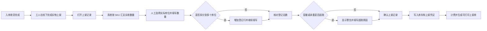

# 上架结果登记模式设计

## 1. 背景

当前上架功能采用“系统事前指导”模式：系统根据商品尺寸、库位容量和现有库存推荐库位及推荐数量，仓库人员按照系统计划完成实物上架。

实际运营中，仓库人员会先根据现场空间、搬运便利性和经验完成货物摆放，然后再将实际结果录入系统。系统无法完整反映现场可拆装、可压缩、临时堆放和实际测量差异，因此不应继续决定工人必须把货物放在哪里。

本次将上架模块改为“实物先上架，系统后登记”。系统承担事实记录、归属校验、数量核对、容量提示、库存入账、计费和审计职责，不再承担库位推荐和推荐数量计算职责。

## 2. 设计目标

1. 入库收货完成后，仓库人员可以按实际摆放结果登记库位和数量。
2. 每种 SKU 可以拆分登记到多个库位。
3. 系统不推荐库位，也不计算推荐数量。
4. SKU 登记总数必须与实收数量完全一致。
5. 体积、承重和混放情况只作为事后提示，不阻止记录真实结果。
6. 超过体积或承重时必须填写原因，并保留在不可修改的上架凭证中。
7. 继续使用现有逻辑库位库存、入库计费和上架凭证体系。
8. 停用旧托盘上架和推荐式逻辑上架写入口，避免两套库存路径并存。

## 3. 不在本次范围内

1. 不增加上架草稿状态。
2. 不恢复托盘、托位或货垛概念。
3. 不增加库位扫码流程，第一版使用可搜索的库位选择器。
4. 不修改入库费率和账单计算规则。
5. 不改变收货、库位调整、盘点、报废、出库和拣货的业务状态机。
6. 不使用装箱算法决定货物是否允许登记。

## 4. 新业务流程



入库单数据库状态继续沿用现有状态：

- `RECEIVED`：前端显示“已收货 · 待登记上架”。
- `COMPLETED`：前端显示“已上架”。

不增加新的数据库状态，避免影响现有统计和下游流程。

## 5. 前端设计

### 5.1 入口和页面名称

原“上架”操作改为“登记上架”。页面和抽屉标题统一使用“上架记录”，避免让工作人员误以为系统会生成作业指导。

### 5.2 页面顶部

显示以下信息：

- 入库单号。
- 货主和 WMS 服务商。
- 仓库。
- 收货操作人和收货时间。
- SKU 种类和实收总件数。

### 5.3 SKU 汇总区域

每个 SKU 显示：

- 内部唯一 SKU。
- 商品图片。
- 商品名称。
- 外箱长、宽、高。
- 单箱毛重。
- 实收数量。
- 已登记数量和剩余未登记数量。

每种 SKU 默认生成一条空登记行，不自动选择库位，不自动填写数量。

### 5.4 登记行

每行包含：

- 品质。
- 实际库位。
- 库位所属分区。
- 当前体积使用率和当前重量。
- 本次登记后的预计体积使用率和预计重量。
- 实际数量。
- 超限原因。
- 拆分和删除操作。

库位选择器支持按库位编号搜索，只显示当前仓库中当前服务商有权使用的物理库位和所有服务商可使用的公共暂存库位。

### 5.5 拆分规则

1. 点击“拆分”在当前 SKU 下增加一条空行。
2. 新行继承品质，不继承库位和数量。
3. 同一种 SKU 可以拆分到任意数量的库位。
4. 同一 SKU、同一品质和同一库位出现重复行时，提交前提示并合并数量。
5. 删除拆分行不影响其他 SKU。
6. 每种 SKU 的登记总数必须等于实收数量。

### 5.6 容量提示

- 正常：显示登记后的使用率。
- 登记后体积或重量达到配置上限的 80% 但未超过 100%：黄色提示，不要求填写原因。
- 超过体积或承重：红色提示，并显示必填的超限原因。
- SKU 缺少尺寸或重量：提示“容量仅供参考”，允许登记。
- 超限不阻止保存，但未填写原因时禁止提交。

### 5.7 提交结果

提交成功后：

1. 关闭登记页面。
2. 列表状态更新为“已上架”。
3. 提示“上架结果已记录”。
4. 提供“打印上架单”。
5. 打印内容包含入库单、内部 SKU、品质、实际库位、数量、操作人、时间和超限原因。

不生成或打印托盘标签。

## 6. 后端接口

### 6.1 获取登记上下文

```text
GET /wms/inbound-execution/putaway-record-context?inboundOrderId={id}
```

返回：

- 入库单头信息。
- 按 SKU 汇总的实收数量。
- 内部 SKU、商品图片、尺寸和重量。
- 可使用库位列表。
- 库位当前容量摘要。

不返回推荐库位、推荐数量、推荐优先级和自动分配结果。

### 6.2 提交上架记录

```text
POST /wms/inbound-execution/putaway-record
```

提交结构：

```text
inboundOrderId
lines[]
  skuCode
  quality
  locationId
  quantity
  capacityOverrideReason
afterHours
afterHoursReason
confirmedVolumeCbm
```

`afterHours`、`afterHoursReason` 和 `confirmedVolumeCbm` 继续用于现有入库计费，不改变原收费规则。

## 7. 校验规则

### 7.1 硬性校验

以下情况拒绝提交：

1. 入库单不存在或状态不是 `RECEIVED`。
2. SKU 不属于该入库单。
3. 数量不是正整数。
4. 任一 SKU 的登记总数不等于实收数量。
5. 目标库位不存在、已停用或不属于该入库单仓库。
6. 普通库位不在当前服务商有效使用范围内。
7. 品质与库位分区不匹配。
8. 同一入库单已被其他操作人完成登记。
9. 超出体积或承重但没有填写原因。

公共暂存库位不受服务商货架分配限制，但必须属于当前仓库。

### 7.2 软性校验

以下情况只提示，不拒绝提交：

1. 登记后体积超过库位容量。
2. 登记后重量超过库位承重。
3. 库位配置了最大 SKU 种类数，并且登记后超过该数量。
4. SKU 缺少尺寸或重量，无法准确计算容量。

超限原因至少支持：

- 现场测量与系统尺寸不一致。
- 临时堆放。
- 商品可压缩或可拆装。
- 库位参数不准确。
- 其他。

选择“其他”时必须填写补充说明。

## 8. 容量异常展示

库位是否容量异常根据当前库存和库位参数实时计算，不新增需要在所有库存操作中同步维护的永久异常标志。

规则如下：

- 当前占用体积大于库位体积时显示体积异常。
- 当前重量大于最大承重时显示承重异常。
- 货物移出后重新计算，恢复正常时异常提示自动消失。
- 每次超限登记的原因永久保存在上架凭证明细中，用于历史追溯。

该方案避免出库、移库、盘点或报废后出现过期的异常状态。

## 9. 事务和并发

确认上架时，在一个数据库事务中执行：

1. 使用行锁读取入库单。
2. 确认状态为 `RECEIVED`。
3. 合并同 SKU、同品质、同库位的重复行。
4. 按库位 ID 排序并锁定所有目标库位，避免并发死锁。
5. 重新读取目标库位当前库存。
6. 对整张上架单按库位汇总本次新增数量。
7. 重新计算体积、重量和 SKU 种类。
8. 校验超限原因。
9. 增加逻辑库位库存。
10. 保存不可修改的上架凭证明细。
11. 保存操作人和操作时间。
12. 生成现有入库计费记录。
13. 使用状态条件更新将入库单改为 `COMPLETED`。

任何一步失败都回滚库存、凭证、计费和状态变更。

## 10. 旧接口和旧逻辑处理

新增接口上线后，停用以下写接口：

```text
POST /wms/inbound-execution/putaway
POST /wms/inbound-execution/logical-putaway
```

调用旧接口时返回：

```text
旧版上架模式已停用，请使用上架记录功能
```

同时处理：

1. 前端删除推荐库位和推荐数量类型。
2. 上架页面删除自动分配代码。
3. 删除“超过推荐数量”的旧提示。
4. 删除上架页面中的托盘和托位选择。
5. 检查 `LocationRecommendationService` 的所有引用；没有其他业务依赖时再删除。
6. 保留历史上架凭证查询和打印能力。
7. 不修改已经完成的历史上架单。

## 11. 对其他模块的影响

上架结果继续写入现有逻辑库位库存，因此以下模块继续使用原数据来源：

- 库位库存。
- 库位调整。
- 盘点管理。
- 报废管理。
- 退货质检。
- 销售出库和拣货。
- 库存统计和资产统计。
- 入库计费。

本次需要重点回归库位调整、盘点和销售出库，确认它们可以读取新登记的库存，不再依赖托盘或旧物理批次库存。

## 12. 测试与验收

至少覆盖以下场景：

1. 单 SKU、单库位登记成功。
2. 单 SKU 拆分到多个库位成功。
3. 多 SKU 登记到同一库位成功。
4. 重复的 SKU、品质和库位行被正确合并。
5. 登记总数少于或大于实收数量时拒绝提交。
6. 体积超限且填写原因后允许保存。
7. 承重超限且填写原因后允许保存。
8. 超限但未填写原因时拒绝提交。
9. SKU 缺少尺寸或重量时允许保存并显示提示。
10. 无权使用的物理库位不能提交。
11. 公共暂存库位可以跨服务商使用。
12. 不良品与分区不匹配时拒绝提交。
13. 两人同时登记同一入库单时只有一个事务成功。
14. 计费失败时库存和状态全部回滚。
15. 完成后的库存、上架凭证和打印内容一致。
16. 旧托盘上架和推荐式上架接口不能继续写库存。
17. 库位库存、库位调整、盘点和出库可以读取登记后的库存。

## 13. 验收标准

1. 页面不再出现推荐库位、推荐数量和自动分配结果。
2. 工人可以完整记录一种 SKU 分布在多个库位的实际情况。
3. 系统不会因体积或承重超限拒绝记录现实库存。
4. 超限记录具有明确原因和操作人，可追溯。
5. 上架完成后库存、计费、凭证和状态保持事务一致。
6. 旧上架接口无法造成新旧库存路径并存。
7. 下游库存业务不需要读取托盘或旧物理批次数据。
