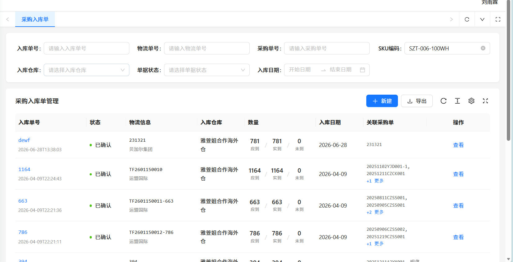

# 系统文档

# 海外仓平台（超级用户）

## 仓库管理

### 创建仓库

填写仓库的信息： 仓库编码，仓库名称 仓库类型  所属区域 联系人 联系电话 联系地址 仓库参数（多少排，每排多少层 ，每排多少列 这些列构建成库位，创建库位，用于存放货物）

### 仓库预览

查看所有仓库的当前状态，类似二维平面 上方有一个搜索栏，可以筛选仓库，下面是点击后可以看到当前仓库的二维平面 ，每一排属于哪一个客户

### 账户开通

为每个WMS用户进行账户开通，管理WMS的账户信息 公司名字 联系方式 地址

### 仓库开通

为每个账户创建 添加 账户：

首先是添加多个仓库中的某一个，其次添加具体仓库中的某一排。并且设置仓库的到期时间。 这里需要同步上传签署的实际的合同。

## 入库管理

### 收货

海外仓平台接收由 ERP\+OMS 用户创建的（自定义入库单/采购入库单）进行收货。

海外仓库收到货后，收货员需要先找到入库清单，若无入库清单则需要【打印入库单】，用于清点货物数量，收货员可将清点结果记录到入库清单上，确认入库单数量后再通过系统做收货操作；若SKU无条码，则需要打印产品代码条码贴到SKU上，方便后续仓库拣货配货；

整个界面由两部分组成

1 第一部分为搜索栏 按照筛选条件进行入库单的筛选

2 第二部分为展示部分，展示所有推送到这里的入库单，操作为待收货，点击收货后可进行收货。

收货流程：

收货员入库搜索选择：入库单号（默认选择），使用扫描枪扫描入库清单左上角的条形码输入入库单号【搜索】（扫描枪自带回车会自动搜索）开始收货；

收货员点击【标记到货】触发系统自动脚本服务（异步服务不是实时）将入库单在OMS【入库单管理】的转运中状态流转至尾程收货状态，卖家客户可以在OMS及时了解货物到仓动态；

收货员录入实收数量，点击【确认收货】弹窗确认提交窗口，点击【确认\(OK\)】完成入库单收货，收货完成的SKU自动创建海外仓产品仓库属性，入库单状态自动同步回OMS，OMS【入库单管理】入库单状态流转至收货完成。

### 上架

上架的基础逻辑是将货物按照SKU进行分类放置，存在几种情况：1 假设该SKU仓库中不存在 将该类SKU都放置在同一个库位中，若超过一个库位则就近选择一个库位继续整体存放。 2 若当前SKU存放在仓库中， 该SKU库位剩余空间够继续存放 该SKU则放入其中，若剩余空间不足 则重新分配一个库位进行放置。

整个界面由两部分组成

上架方式选择：默认（默认选择），上架搜索选择：入库单号（默认选择）使用扫描枪扫描入库清单左上角的条形码输入入库单号【搜索】（扫描枪自带回车会自动搜索）开始上架；

1 第一部分为搜索栏按照筛选条件进行入库单的筛选

2 第二部分为展示部分，展示所有已经收货的入库单，操作为待上架，点击上架后可进行上架

上架搜索选择：入库单号（默认选择）使用扫描枪扫描入库清单左上角的条形码输入入库单号，（扫描枪自带回车会自动搜索）开始上架；

上架员确认实际上架数（自动填充SKU待上架数），若该SKU待上架数全部上架到同一库位，实际上架数不用修改，按SKU实际上架库位选择库位即可；若该SKU待上架数是分开上架到不同库位，则需要修改实际上架数再选择库位，确认上架后再继续点击搜索，将剩余待上架SKU继续维护实际上架数和选择库位上架

架员点击【确认上架】将SKU实际上架数上架到指定库位，系统产生批次库存并同步回OMS【库存管理】，待所有SKU实际上架数全部上架后，入库单完成上架

## 出库管理

此部分内同你参考这个文件中进行设计C:\\Users\\86178\\Documents\\temp\\易仓一件代发WMS操作指南\(2\)\.docx

### 订单下架

### 订单出库

## 退货管理

退货管理设计成一个重新入库即可，只不过添加一个质检的环节

## 权限管理

对于海外仓平台用户：角色可以分为两类 1 管理员：可以看到所有的界面能够进行仓库的创建以及预览 账户开通的，角色添加功能。

2 普通员工 普通员工的主要进行主要的货物操作职责 比如出库 入库 退货 具体的管理工作

### 财务系统

应收

# ERP\+OMS用户

## 数据分析

当前数据分析业务内容不变

## 系统管理

此界面内容不变

## 日志管理

此界面内容不变

## 订单管理

此界面内容不变

## 财务管理

此界面内容不变

## 仓库管理

### 物流商管理

此界面内容不变

### 采购单管理

此界面内容不变

### 物流单管理

此界面内容不变

### 采购入库单

此界面基本不变，只是这里的逻辑功能需要修改，在原本的入库逻辑是 创建采购单\-》创建物流单\-》由物流单创建入库单 并在此界面进行审批入库通过。现在需要改造，即产生入库单后，推送到海外仓平台中，由其进行入库上架操作，并改变当前采购入库单的状态。收货以及上架的具体的操作归属于海外仓平台，你可以去查阅

### 自定义入库单（新增模块）

自定义入库单的界面应当与采购入库单的界面相同

第一部分是搜索界面。

第二部分是查看部分，能够看到所有的自定义入库单。

流程为：点击新建后创建一个新的自定义入库单（两部分内容）

1 入库信息 ：目的仓库 预计到达信息 跟踪单号

2 货品选择 搜索SKU进行选择货品 添加数量

入库单是差不多的，都是推送到海外仓平台统一处理

### 销售出库单

此界面基本保持不变，只是将选择拉取到的销售出库单推送至海外仓平台中，由海外仓平台进行下架（下架后 出库单无法取消，下架后海外仓平台进行拣货，这些操作需要改变对应的状态）

### 自定义出库单

自定义入库单的界面应当与销售出库单的界面相同

第一部分是搜索界面。

第二部分是查看部分，能够看到所有的自定义出库单。

流程为：点击新建后创建一个新的自定义出库单（两部分内容）

出库单都是差不多的都是推送到，海外仓平台进行统一的处理

### 退货订单管理

这里从平台拉取 所有可以退货的订单 进行操作

### 自定义退货单

### 盘点管理

（这个功能进行删除，ERP\+OMS不能进行货物的盘点，应该是海外仓平台进行货物的盘点管理）

### 库存总览

此部分内容不变

### 

### 库存明细

此界面基本不变， 需要我们探讨原本是怎么实现的

### 库存记录

此界面基本不变， 需要我们探讨原本是怎么实现的

### 库存预测

此界面内容基本不变  需要我们探讨原本是怎么实现的

### 库存配置

此界面内容基本不变 需要我们探讨原本是怎么实现的，因为我想要设计更加便捷自由的预测方式，不是固定值。或者存在两种模式 1 固定值模式 2 自定义模式。 自定义模式就是可以自己定义计算规则，我们提供一些固定的可选历史数据，比如一周 或者 一个月内的平均销量 中值 众数等等 进行自己规则的制定。以及可以自定义一些系数。

# WMS

### 账户管理

为每个erp\+oms客户提供服务，开通账号，管理每个erp\+oms用户可以使用哪些区域的仓库

### 财务系统

支出

收入

